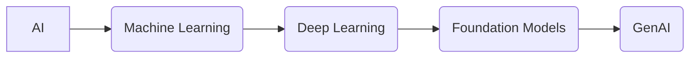

# AI Concepts Explained

*Overview Diagram*

### Defining AI
*   **AI (Artificial Intelligence)** refers to the broad concept of simulating human-like intelligence in machines.
*   It includes tasks such as reasoning, learning, problem-solving, and inferencing.

### Machine Learning (ML)
*   A subfield of AI that focuses on developing algorithms that allow machines to learn from and make decisions based on data, without being explicitly programmed for a specific task.
*   It encompasses a range of techniques, from traditional statistical methods to neural networks.

#### ML Categories
*   **Supervised Learning:** Trained on labeled data where the output is known.
*   **Unsupervised Learning:** Models find patterns in unlabeled data.
*   **Reinforcement Learning:** Models learn by interacting with an environment and receiving feedback.

#### Common ML Techniques
*   Linear Regression
*   Decision Trees
*   Support Vector Machines (SVMs)
*   Clustering Algorithms

### Deep Learning (DL)
*   A specialized subset of Machine Learning.
*   It uses artificial neural networks with multiple layers (hence "deep") to model complex patterns in data.
*   Deep Learning excels at handling vast amounts of unstructured data, such as images, audio, or natural language text.

### Foundation Models (FMs)
*   Large-scale neural networks, typically built using deep learning techniques, that are pre-trained on vast, diverse datasets.
*   They serve as a powerful base or "foundation" that can be adapted to a wide range of downstream tasks through fine-tuning.
*   Foundation models are designed to be general, adaptable, and scalable.

### Generative AI (GenAI)
*   A type of AI, often built upon foundation models, whose key characteristic is the ability to **generate new, original content**.
*   This content can be in various forms, depending on the model's training:
    *   **Large Language Models (LLMs):** Generate text.
    *   **Diffusion Models:** Generate images.
    *   **Audio Models:** Generate sound and music.
    *   **Video Models:** Generate video clips.

### Timeframe of Adoption

*   **AI:** Existed at the research level as far back as the 1970s.
*   **Machine Learning:** Gained widespread popularity in the 2010s.
*   **Generative AI:** Has reached critical mass and widespread adoption in the 2020s.

### Reference

[AI, Machine Learning, Deep Learning and Generative AI Explained](https://www.youtube.com/watch?v=qYNweeDHiyU) by [IBM Technology](https://www.youtube.com/@IBMTechnology)
