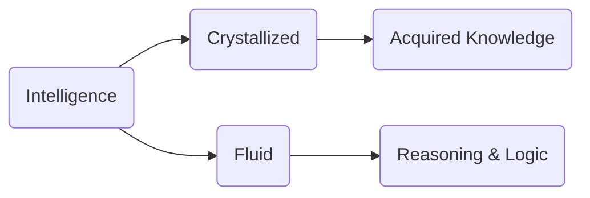

# Crystallized vs. Fluid Intelligence

_Overview Diagram_

### Crystallized Intelligence

- Represents the knowledge and skills acquired through past learning and experience.
- It is fact-based and relies on a person's accumulated expertise.
- Think of it as the "what you know" component of intelligence.

### Fluid Intelligence

- Refers to the capacity to think logically and solve problems in new and unfamiliar situations.
- It is independent of any previously acquired knowledge.
- This involves reasoning, identifying patterns, and using logic to navigate novel challenges.

### Analogy in Artificial Intelligence

The concepts of crystallized and fluid intelligence provide a useful way to understand how AI systems function:

- **Crystallized Intelligence (The Model):** An AI's trained model, with all its pre-trained data and parameters, can be seen as its crystallized intelligence. This is the vast store of information it has learned.
- **Fluid Intelligence (The Application):** The AI's ability to take its "crystallized" knowledge and apply it to solve new, unseen problems or generate novel outputs is analogous to fluid intelligence.

### Reference

- [Fluid vs. Crystallized Intelligence](https://www.youtube.com/watch?v=T7Wr7wVK5Wo) by [IBM Technology](https://www.youtube.com/@IBMTechnology)
