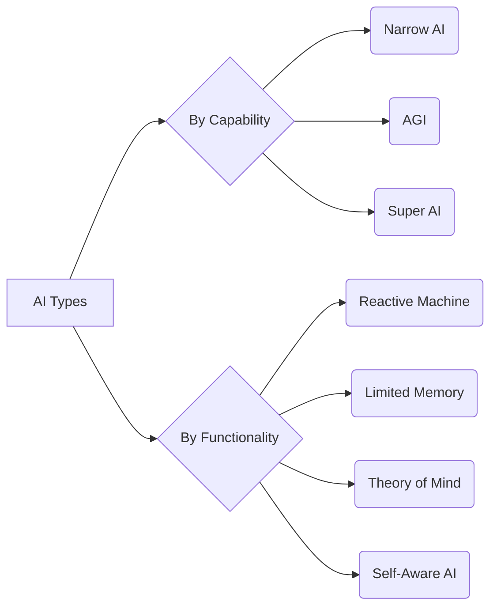

# The Types of Artificial Intelligence

Artificial Intelligence can be classified in two primary ways: by its **capability** (what it can do) and its **functionality** (how it works). Understanding these distinctions helps to clarify what AI is today versus what it might become in the future.

_Overview Diagram_

---

## Classification by AI Capability

This classification focuses on the breadth and flexibility of an AI's intelligence.

### 1. Narrow AI (Weak AI)

- **This is the only type of AI that exists today.**
- Narrow AI is designed and trained to perform a specific, narrow task, such as playing a game, identifying spam, or generating text.
- While it can appear incredibly intelligent within its specialized domain, it cannot operate outside of it. It requires humans to train it on a specific dataset for a specific purpose.

### 2. Artificial General Intelligence (AGI)

- **This is a hypothetical type of AI.**
- AGI, or "Strong AI," refers to a machine with the ability to understand, learn, and apply its intelligence to solve any problem that a human being can.
- It would not require human training for new tasks and could use its past learnings and skills to accomplish novel tasks in entirely different contexts.

### 3. Super AI (ASI)

- **This is a hypothetical type of AI.**
- Artificial Superintelligence represents a level of intelligence that surpasses human capabilities in every domain, including scientific creativity, general wisdom, and social skills.
- If it is ever realized, it would be able to think, reason, and make judgments far beyond human cognition.

---

## Classification by AI Functionality

This classification focuses on how an AI system processes information and interacts with the world, roughly mapping to theories of mind.

### 1. Reactive Machines

- The most basic type of AI. These systems do not form memories or use past experiences to inform current decisions.
- They react to current stimuli in a predictable way based on their programming. A classic example is IBM's Deep Blue, which analyzed the current state of a chessboard to determine its next move.

### 2. Limited Memory AI

- This is the category where most modern AI systems, including **Generative AI** and chatbots, reside.
- These systems use past data and experiences to make better decisions in the present. They are "trained" on historical data, which they use to recognize patterns and make predictions.
- Their "memory" is transient; the learnings are incorporated into the model, but they don't build a persistent library of individual experiences in the way a human does.

### 3. Theory of Mind AI

- **This is a future, hypothetical type of AI.**
- This level of AI would be able to understand the thoughts, emotions, beliefs, and intentions of other entities (both human and AI).
- It would be capable of true social interaction, personalizing its responses based on an understanding of unique emotional and mental states.

### 4. Self-Aware AI

- **This is a hypothetical type of AI.**
- The final stage of AI development, this type of AI would have its own consciousness, self-awareness, and potentially its own set of emotions, needs, and beliefs.
- It would understand its own internal state and be able to predict the feelings of others, representing a true sentient entity.

### Reference

- [The 7 Types of AI - And Why We Talk (Mostly) About 3 of Them](https://www.youtube.com/watch?v=XFZ-rQ8eeR8) by [IBM Technology](https://www.youtube.com/@IBMTechnology)
