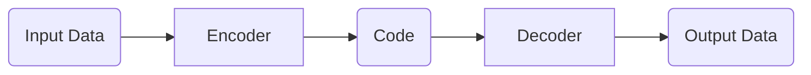

# Autoencoders

_Overview Diagram_

### Introduction

- Autoencoders are unsupervised neural networks.
- They learn to identify which aspects of data are relevant by first compressing the data and then reconstructing it.
- Autoencoders are excellent at separating the signal from the noise, effectively learning to discard irrelevant information.

### Autoencoder Breakdown

An autoencoder consists of two main parts:

- **Encoder:** Compresses the input data into a lower-dimensional representation. This compressed form is often called the "code" or "latent space representation."
- **Decoder:** Takes the compressed code and attempts to reconstruct the original input data from it.

The goal during training is to minimize the reconstruction error, meaning the output should be as similar to the original input as possible.

### Convolutional Autoencoders

- These are a specialized type of autoencoder that use convolutional layers, making them particularly effective for image-related tasks.
- They can take an image as input and:
  - Derive the essential features of the image.
  - Remove noise from the image (denoising).
  - Colorize black and white images.
  - Generate higher-resolution versions of the output image.

### Latent Space Representation (The "Code")

- The encoder compresses the input data through progressively smaller layers.
- The most compressed layer is known as the **bottleneck**. This layer contains the latent space representation, which is the most compact summary of the input data.
- This "code" is what the decoder uses to reconstruct the original data.

### Use Case: Anomaly Detection

- Autoencoders are highly effective at detecting anomalies or outliers in data.
- **How it works:**
  1.  The autoencoder is trained on a dataset containing only "normal" or non-anomalous data.
  2.  It becomes very good at reconstructing this normal data with a low error rate.
  3.  When an anomalous data point (which the model has never seen) is fed into the network, the autoencoder struggles to reconstruct it accurately, resulting in a high reconstruction error.
- By monitoring the reconstruction error, you can identify significant deviations from the norm. This has practical applications in:
  - **Fault detection** in manufacturing.
  - **Fraud detection** in financial transactions.
  - **Intrusion detection** in network security.

### Reference

[What are Autoencoders?](https://www.youtube.com/watch?v=qiUEgSCyY5o) by [IBM Technology](https://www.youtube.com/@IBMTechnology)
