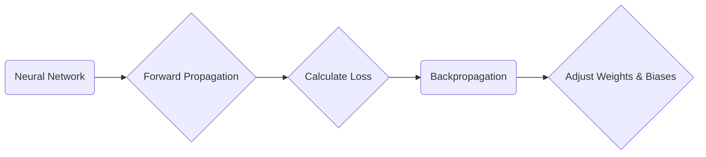

# Backpropagation

_Overview Diagram_

### Introduction

Backpropagation is a fundamental algorithm central to the functioning of neural networks, enabling them to learn from data and adapt over time. It is the process by which a network corrects its errors to improve accuracy.

### How Neural Networks Learn

A neural network consists of multiple layers of interconnected neurons (or nodes). Data flows from an input layer, through one or more hidden layers, to an output layer.

1.  **Forward Propagation:** Input data is passed forward through the network. At each layer, the data is transformed by the neurons' weights, biases, and activation functions until an output (a prediction) is produced.
2.  **Error Calculation:** The network's initial output is compared to the actual, correct value from the training data. The difference between the predicted and actual values is calculated using a **Loss Function**. A high loss value means the prediction was far from the correct answer.
3.  **Backpropagation:** This is the error correction phase. The calculated error is propagated _backward_ from the output layer through the network. This process assigns a portion of the total error to each neuron, measuring its contribution to the mistake.
4.  **Weight and Bias Adjustment:** Using an optimization algorithm like **Gradient Descent**, the network adjusts the weights and biases of its neurons in the direction that will most effectively minimize the loss function.

This cycle of forward propagation, error calculation, and backpropagation is repeated thousands or millions of time, allowing the network to "learn" the optimal weights and biases to make accurate predictions.

### Key Terms

- **Weights:** Numerical values that define the strength and importance of the connections between neurons. These are the primary parameters the network learns.
- **Biases:** Values that shift the activation function, adding flexibility to the network's learning process.
- **Activation Functions:** Non-linear functions (e.g., Sigmoid, ReLU) applied at each neuron. They allow the network to model complex, non-linear relationships in the data.
- **Loss Function (or Cost Function):** A function that measures how inaccurate the network's predictions are compared to the actual values. The goal of training is to minimize this function.
- **Gradient Descent:** An optimization algorithm used to find the minimum of the loss function by iteratively adjusting the weights and biases in the direction of the steepest descent (the "gradient").

### Types of Backpropagation Networks

- **Static Backpropagation:** Used in feed-forward neural networks where the output depends only on the current input. Common applications include Optical Character Recognition (OCR) or spam detection.
- **Recurrent Backpropagation:** Used in Recurrent Neural Networks (RNNs) where the output can depend on previous inputs (i.e., it has memory). This is common in time-series analysis or sentiment analysis.

### Reference

[What is Back Propagation](https://www.youtube.com/watch?v=S5AGN9XfPK4) by [IBM Technology](https://www.youtube.com/@IBMTechnology)
