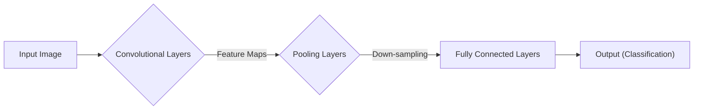

# Convolutional Neural Network (CNN)

_Overview Diagram_

### Introduction

- A Convolutional Neural Network (CNN) is a type of deep learning neural network designed to process and analyze visual imagery.
- The primary goal of a CNN is to achieve object recognition by automatically and adaptively learning spatial hierarchies of features from input images, using filters (or kernels).
- CNNs are excellent for pattern recognition tasks.

### CNN Breakdown

- **Neural Network:** A system of interconnected nodes, or neurons, organized in layers. Each layer receives input, performs a transformation, and passes the result as output to the next layer.
- **Convolutional Layers:** These are the core building blocks of a CNN.
  - They consist of a set of learnable filters (kernels) that slide (or "convolve") across the input image.
  - These filters are small matrices of weights that are trained to detect specific features like edges, corners, and textures in the image.
  - As the filter moves over the image, it performs a dot product between its weights and the input pixels, creating a "feature map" that highlights where those specific features are located.

### How a CNN Works

1.  **Input:** A real-world image is represented as a grid of pixel values.
2.  **Convolution:** The CNN's convolutional layers apply filters to small sections of the image. For example, some filters might activate when they detect a straight line, while others might activate for a specific color or shape. This process creates multiple feature maps.
3.  **Pooling:** After convolution, pooling layers (like Max Pooling) are used to down-sample the feature maps. This reduces the spatial dimensions of the data, which helps to decrease computational complexity and control overfitting. It essentially summarizes the features present in a region of the feature map.
4.  **Fully Connected Layers:** After several convolutional and pooling layers, the high-level features are flattened into a one-dimensional vector. This vector is then fed into a standard fully connected neural network.
5.  **Output:** The final layer of the fully connected network produces the output, which could be a classification (e.g., "cat" or "dog") or a probability score for different classes.

Through this hierarchical process, a CNN can learn to recognize complex objects, even if they are distorted, partially obscured, or viewed from different angles.

### Use Cases

- Image and visual recognition (e.g., identifying objects in photos).
- Medical image analysis (e.g., detecting tumors in scans).
- Autonomous vehicles (e.g., identifying pedestrians and traffic signs).
- Document analysis (e.g., handwriting recognition).

### Reference

[What are Convolutional Neural Networks (CNNs)?](https://www.youtube.com/watch?v=QzY57FaENXg) by [IBM Technology](https://www.youtube.com/@IBMTechnology)
