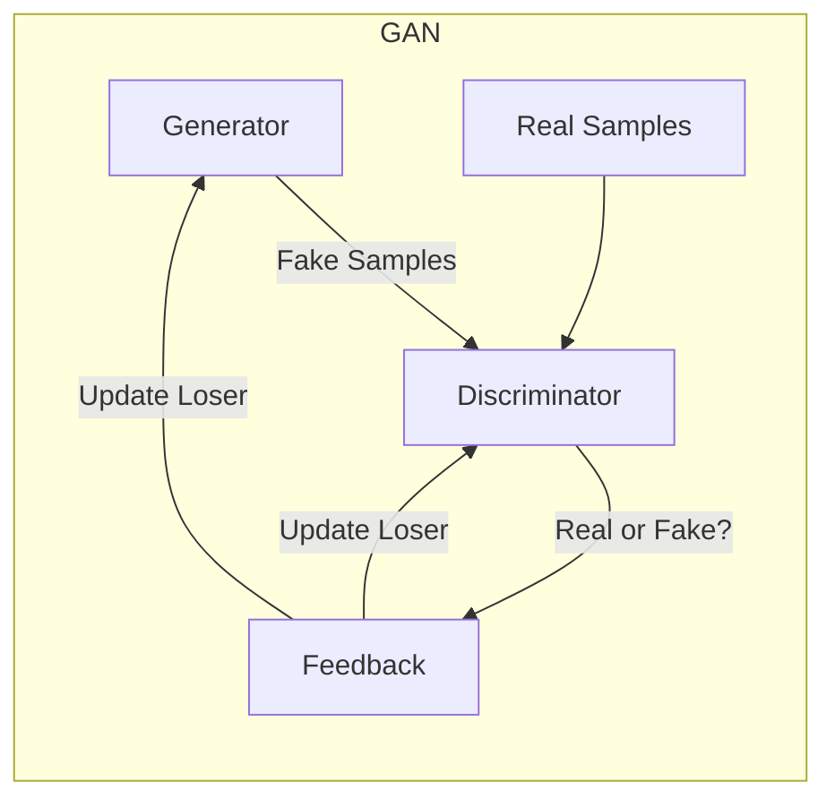

# Generative Adversarial Network (GAN)

_Overview Diagram_

### GAN Introduction

A Generative Adversarial Network (GAN) is a type of unsupervised machine learning model that pits two neural networks against each other to generate new, synthetic instances of data that can pass for real data.

### Supervised vs. Unsupervised Learning

- Most machine learning models are **supervised**, meaning they are trained on labeled data to make predictions. The model's output is compared to the expected output, and the model is updated to minimize the error.
- GANs, however, are an example of **unsupervised learning**. The system effectively supervises itself without needing pre-labeled data.

### How a GAN Works: The Two Sub-Models

A GAN consists of two competing sub-models:

1.  **The Generator:** Its job is to create fake data samples (e.g., images, audio). It starts by generating random noise and, over time, learns to produce increasingly realistic output.
2.  **The Discriminator:** Its job is to act as a classifier. It takes a given sample (either a real one from the training dataset or a fake one from the Generator) and determines whether it is real or fake.

### The Adversarial Process (A Zero-Sum Game)

The two models are trained in a continuous cycle that resembles a game:

1.  The Generator creates a batch of fake samples and passes them to the Discriminator.
2.  The Discriminator is shown a mix of real samples and the fake samples from the Generator and tries to distinguish them.
3.  A feedback loop updates the models based on the outcome:
    - If the Discriminator correctly identifies the fakes, only the **Generator** is updated to improve its ability to fool the Discriminator next time.
    - If the Generator successfully fools the Discriminator, only the **Discriminator** is updated to get better at spotting fakes.
4.  This is a **zero-sum game**: one model's loss is the other's gain. This competitive process continues until the Generator is producing samples that are so convincing they are nearly indistinguishable from real data.

### Implementation

Both the Generator and Discriminator are typically implemented as **Convolutional Neural Networks (CNNs)**, as CNNs are highly effective at recognizing patterns in image data.

### Applications of GANs

GANs have a wide range of creative and practical applications:

- **Image Generation:** Creating realistic, high-resolution images, such as faces of non-existent people or 3D models.
- **Image Enhancement:** Upscaling low-resolution images to higher resolutions.
- **Video Frame Prediction:** Predicting the next frame in a video sequence, which is useful for surveillance systems.
- **Encryption:** Creating secure encryption algorithms where the generator and discriminator act as the encrypting and decrypting parties.

### Reference

[What are GANs (Generative Adversarial Networks)?](https://www.youtube.com/watch?v=TpMIssRdhco) by [IBM Technology](https://www.youtube.com/@IBMTechnology)
