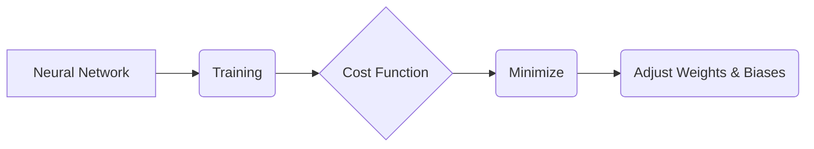

# Gradient Descent

_Overview Diagram_

### Introduction

- Gradient Descent is a common optimization algorithm used to train Machine Learning models and neural networks.
- By training on data, models can learn over time and improve their accuracy.

### How Neural Networks Work

- A neural network consists of connected neurons organized in layers.
- These layers have weights and biases, which are parameters that the network adjusts to navigate through the data.
- Labelled training data is fed into the neural network to help determine the optimal settings for these weights and biases.

### Adjusting Weights and Biases

- Initially, the network's predictions may be wrong. Gradient descent is the process used to correct these errors.
- A **cost function** (or loss function) is used to measure how far off the predictions are from the actual values.
- The goal is to minimize this cost function to get the best possible predictions.
- This is done by taking small, iterative steps in the direction that most rapidly reduces the cost function (the direction of steepest descent).
- The size of these steps is controlled by a parameter called the **learning rate**.

### Types of Gradient Descent

| Type           | Description                                                                        | Computational Effectiveness | Processing Times |
| :------------- | :--------------------------------------------------------------------------------- | :-------------------------- | :--------------- |
| **Batch**      | Sums the cost for every point in the training set before updating the model.       | High                        | Long             |
| **Stochastic** | Evaluates and updates the model after each individual training example.            | Low                         | Fast             |
| **Mini-Batch** | Splits the training data into small batches and performs an update for each batch. | Medium                      | Medium           |

### Challenges with Gradient Descent

- **Local Minima:** In complex, non-convex problems, gradient descent can get stuck in a "local minimum" and fail to find the "global minimum," which is the true best solution.
- **Vanishing Gradients:** If the gradients (the slope of the cost function) become extremely small, the model's weights and biases will update very slowly, effectively stopping the learning process for earlier layers in the network.
- **Exploding Gradients:** Conversely, if the gradients become too large, it can lead to large, unstable updates that prevent the model from converging on a good solution.

### Reference

[Gradient Descent Explained](https://www.youtube.com/watch?v=i62czvwDlsw) by [IBM Technology](https://www.youtube.com/@IBMTechnology)
