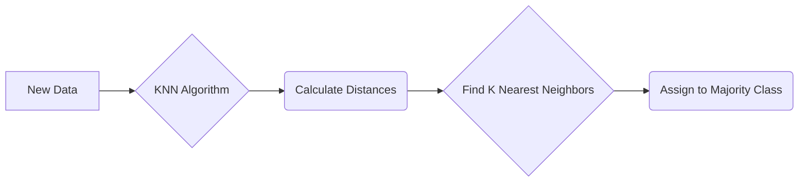

# K-Nearest Neighbors (KNN)

_Overview Diagram_

### What is K-Nearest Neighbors?

K-Nearest Neighbors (KNN) is a popular and simple classification and regression algorithm used in Machine Learning. KNN operates on the assumption that similar data points are located near each other in a given feature space.

### How It Works: An Example

Imagine you have a dataset of fruit categorized by two features: **Sweetness** and **Crunchiness**.

1.  Plot the known fruits (apples and oranges) on a graph based on these two features.
2.  To classify a new, unknown fruit, you first measure its sweetness and crunchiness and plot it on the same graph.
3.  The KNN algorithm then looks at the "**K**" nearest data points (neighbors) to the new fruit.
4.  It counts the class of each of these neighbors. If the majority of the nearest neighbors are apples, the new fruit is classified as an apple.

### Requirements for KNN

- **Distance Metric:** The "nearness" of data points must be defined. Common distance metrics include:
  - **Euclidean Distance:** The straight-line distance between two points.
  - **Manhattan Distance:** The distance between two points measured along the axes at right angles.
- **The "K" Value:** You must define a value for "K," which specifies how many neighbors the algorithm should check to classify a new data point.
  - It's recommended to choose an **odd number** for K (e.g., 3, 5, 7) to avoid ties in classification.

### Strengths of KNN

- **Easy to Implement:** The algorithm is straightforward to understand and code.
- **Few Hyperparameters:** The main parameters to tune are K and the distance metric.
- **Adaptable:** The model easily adapts to new training data since the "learning" happens at prediction time.

### Weaknesses of KNN

- **Does Not Scale Well:** The algorithm becomes computationally expensive and slow as the size of the dataset grows, because it needs to calculate the distance to every training point for each new prediction.
- **Curse of Dimensionality:** In datasets with a high number of features (dimensions), the distance between points becomes less meaningful, which can lead to errors in classification.
- **Prone to Overfitting:** Choosing a small value for K can make the model sensitive to noise and outliers. An appropriate value must be selected to balance bias and variance.

### Common Use Cases

- Simple recommendation systems (e.g., "users who liked this also liked...").
- Data pre-processing, such as imputing missing values.
- **Finance:** Stock market forecasting, currency exchange rates, and fraud detection.
- **Healthcare:** Predicting the risk of heart attacks or other medical conditions.

### Reference

[What is the K-Nearest Neighbor (KNN) Algorithm?](https://www.youtube.com/watch?v=b6uHw7QW_n4) by [IBM Technology](https://www.youtube.com/@IBMTechnology)
