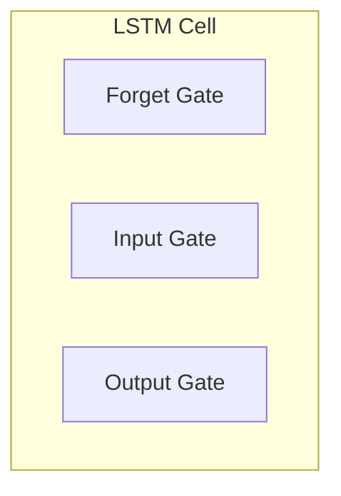

# Long Short Term Memory (LSTM)

_Overview Diagram_

### Introduction

- Long Short Term Memory (LSTM) is a type of neural network designed to handle long-term dependencies in sequential data.
- LSTM allows a network to remember information for long periods and forget information that is no longer relevant, providing a solution to the vanishing gradient problem in traditional RNNs.

### LSTM in Recurrent Neural Networks

- An LSTM network is a type of Recurrent Neural Network (RNN).
- In a standard RNN, a node receives input, processes it, and produces an output. The output from one step is then fed back as input to the next step, creating a loop or "recurrence."
- This recurrence allows RNNs to process sequences, but they suffer from **long-term dependency issues**: as the sequence gets longer, the network struggles to pass information from earlier steps to later ones.

### LSTM Cells

- LSTMs solve the long-term dependency problem by introducing an internal **cell state** and a series of **gates** that regulate the flow of information.
- The LSTM cell has three main gates that control the information:
  - **Forget Gate:** Decides which information from the cell state should be discarded or forgotten. It looks at the previous hidden state and the current input and outputs a number between 0 (completely forget) and 1 (completely keep).
  - **Input Gate:** Determines what new information should be stored in the cell state. It has two parts: a sigmoid layer that decides which values to update and a `tanh` layer that creates a vector of new candidate values.
  - **Output Gate:** Decides what information from the cell state should be used to generate the output. The cell state is passed through a `tanh` function and multiplied by the output of a sigmoid gate.

### Use Cases for LSTMs

LSTMs are particularly effective for tasks involving sequential data, such as:

- Machine Translation
- Speech Recognition
- Q&A Chatbots
- Time Series Forecasting

### Reference

[What is LSTM (Long Short Term Memory)?](https://www.youtube.com/watch?v=b61DPVFX03I) by [IBM Technology](https://www.youtube.com/@IBMTechnology)
