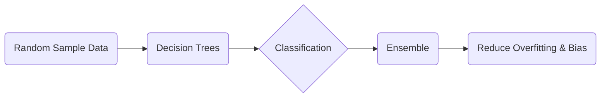

# Random Forest

_Overview Diagram_

### What Is A Random Forest?

- It is a type of Machine Learning Model.
- The model is built by taking a random sample of data and building an ongoing series of Decision Trees to make predictions.
- Helps get around the limitations of data.

### How Random Forests Help

- Decision Trees can be prone to problems like bias and overfitting.
  - **Overfitting:** Occurs when a model starts to memorize the training data rather than generalizing to make accurate predictions on new, unseen data.
  - **Bias:** Can occur when a model makes systematic errors, often due to overly simplistic assumptions during training.

### Setting Up a Random Forest

When creating a Random Forest, you need to configure several key hyperparameters:

1.  **Node Size:** The minimum number of data points required in a node before it can be split.
2.  **Number of Trees:** The total quantity of individual decision trees to build within the ensemble. More trees generally lead to better performance but increase computational cost.
3.  **Number of Features:** The number of features to randomly select and consider at each split point in a tree.

### Applications of Random Forest

- **Finance:** Can be used to predict the likelihood of a loan default.
- **Medicine:** Can be used to predict patient prognosis or survival rates based on different treatment options.
- **Economics:** Can be used to evaluate the effectiveness of a policy change.

### Reference

[What is Random Forest?](https://www.youtube.com/watch?v=gkXX4h3qYm4) by [IBM Technology](https://www.youtube.com/@IBMTechnology)
