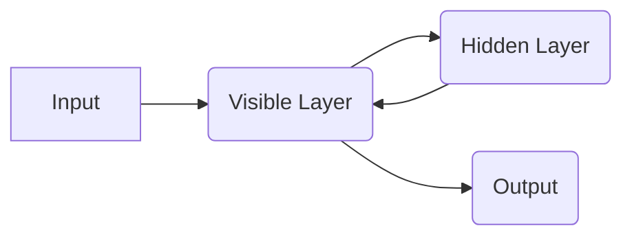

# Restricted Boltzmann Machine (RBM)

_Overview Diagram_

### What is an RBM?

- A Restricted Boltzmann Machine (RBM) is a probabilistic graphical model used for unsupervised learning.
- The goal is to discover hidden structures in the data.

- RBMs take an input and pass it to the hidden layers. Then, the hidden layers pass it _back_ to the visible (input) layers to generate the output. This is different from standard feedforward networks which only pass the input forward.

- RBMs consist of two layers of nodes:
  - **Visible Layer:** The input layer. This receives the input data (training data).
  - **Hidden Layer:** Used for the training process. This layer can consist of a classification.

### RBM Neural Network Layout

- Every node in the visible layer is connected to every node in the hidden layer.
- There is no connection between nodes in the same layer.

### Feed Forward Pass

- Training data in the visible layer is multiplied by weights and added to a bias value at the hidden layer.
- The network identifies the positive association, this is where the link between the visible unit and the hidden unit is a match.

### Feed Backward Pass

- This pass determines how weighting should be adjusted.
- Weight adjustments.
- Bias adjustments.
- Logging probability for every edge between layers.

### Applications of RBM

- Recommend movies.
- Feature extraction.
- Pattern recognition, such as with handwritten text.

### Reference

[What is an RBM (Restricted Boltzmann Machine)?](https://www.youtube.com/watch?v=L3ynnRgpZwg) by [IBM Technology](https://www.youtube.com/@IBMTechnology)
