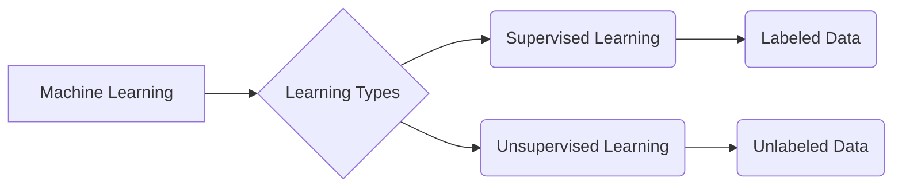

# Supervised vs Unsupervised Learning

_Overview Diagram_

### Introduction

- Supervised and unsupervised learning are two fundamental approaches in machine learning, distinguished primarily by the type of data they use for training.

### Supervised Learning

Supervised learning uses **labeled data**, where both the input and the desired output are known. The model learns to map inputs to outputs.

- **Key Characteristics:**
  - Trained on a dataset containing input-output pairs.
  - The goal is to learn a function that can predict the output for new, unseen inputs.
  - Measures its accuracy against the known outputs and improves over time.
  - Generally more accurate than unsupervised learning for predictive tasks.

- **Common Tasks:**
  - **Classification:** The output is a discrete category (e.g., "spam" or "not spam"). Examples include Support Vector Machines (SVMs), decision trees, and random forests.
  - **Regression:** The output is a continuous value (e.g., predicting a house price or a stock value). Linear and logistic regression are common examples.

### Unsupervised Learning

Unsupervised learning uses **unlabeled data**, where the desired output is not known. The model must discover hidden patterns and structures in the data on its own.

- **Key Characteristics:**
  - No predefined labels or outputs are provided.
  - The model explores the data to find inherent structures.
  - Requires no human intervention to label the data.
  - Can find patterns and insights that might be missed by supervised models.

- **Common Tasks:**
  - **Clustering:** Grouping similar data points together. A common application is customer segmentation.
  - **Association:** Discovering relationships between variables in the data. Market basket analysis (e.g., "customers who bought X also bought Y") is a classic example.
  - **Dimensionality Reduction:** Reducing the number of variables in a dataset while retaining important information. This helps to remove noise and simplify the data. Autoencoders are a common technique for this.

### Semi-Supervised Learning

This approach is a middle ground that uses a combination of both labeled and unlabeled data.

- **Key Characteristics:**
  - It's useful when labeling data is expensive or time-consuming.
  - A small amount of labeled data can be used to guide the learning process on a much larger pool of unlabeled data, often leading to significant performance improvements.
  - Commonly used in fields like medical imaging, where expert labeling is a bottleneck.

### Conclusion

The choice between supervised and unsupervised learning depends on the nature of your data and the problem you are trying to solve. If you have labeled data and a clear predictive goal, supervised learning is typically the better choice. If you have unlabeled data and want to discover hidden patterns or structures, unsupervised learning is the way to go.

### Reference

[Supervised vs. Unsupervised Learning](https://www.youtube.com/watch?v=W01tIRP_Rqs) by [IBM Technology](https://www.youtube.com/@IBMTechnology)
