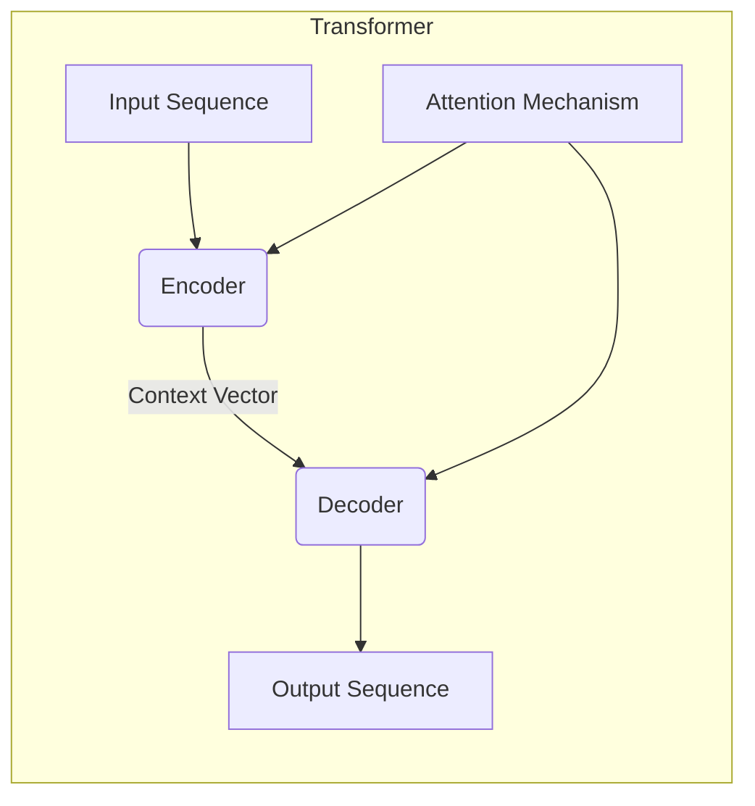

# Transformers

_Overview Diagram_

### Introduction

Transformers are a type of neural network architecture designed to handle sequential data, with their most common application being the transformation of one sequence into another, such as in language translation.

### Components

Transformers have two main components that work in tandem:

- **Encoder:** This part processes the input sequence (e.g., a sentence in English) and compresses it into a high-dimensional representation called a "context vector." This vector captures the meaning and relationships within the input.
- **Decoder:** This part takes the context vector from the encoder and generates the output sequence (e.g., the translated sentence in French), one token at a time.

### How They Work

- **Sequence-to-Sequence Learning:** Transformers take a sequence of tokens (like words or sub-words) as input and are trained to predict the next token in an output sequence.
- **Attention Mechanism:** This is the key innovation of Transformers. The attention mechanism allows the model to weigh the importance of different words in the input sequence when producing a word in the output sequence. This helps the model handle long-range dependencies and understand context more effectively than older architectures like RNNs or LSTMs.
- **Semi-Supervised Learning:** They are typically pre-trained in an unsupervised manner on a massive, unlabeled dataset (like the entire internet). This allows them to learn general language patterns. They are then fine-tuned on a smaller, labeled dataset for a specific task.
- **Parallel Processing:** Unlike RNNs, which process sequences one token at a time, Transformers can process all tokens in a sequence simultaneously. This parallelism makes training significantly faster and more efficient.

### What Can Transformers Do?

While they originated in natural language processing, their application has expanded to other domains. Common use cases include:

- Document Summaries
- Generating new text (e.g., articles, blog posts)
- Language translation
- Playing strategic games like chess
- Image processing and generation

### Reference

- [What are Transformers (Machine Learning Model)?](https://www.youtube.com/watch?v=ZXiruGOCn9s) by [IBM Technology](https://www.youtube.com/@IBMTechnology)
