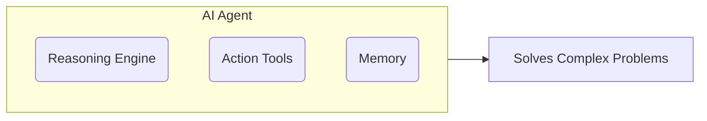

# AI Agents

_Overview Diagram_

### The Shift from Monolithic to Compound AI

There is a significant shift in AI development from building large, monolithic models to creating **compound AI systems**.

- **Monolithic Models:** These are single, large models trained for a general purpose. They are powerful but can be limited in their knowledge (if information wasn't in their training data) and are often difficult and slow to adapt.
- **Compound AI Systems:** These systems address problems by breaking them down into smaller, manageable modules. They orchestrate multiple components, including specialized models and tools, to solve complex queries step-by-step. This modular approach makes them more adaptable, maintainable, and efficient. AI agents are a key component of this new paradigm.

### LLM Agent Capabilities

An AI agent is more than just a language model; it's a system that can perceive its environment, reason about its goals, and take actions to achieve them. The core capabilities of an LLM-based agent are:

1.  **Reasoning:** The agent uses its core LLM as a "reasoning engine" to understand a user's request, break down the problem into smaller steps, and create a plan to solve it. A popular framework for this is **ReAct (Reason and Act)**, which combines reasoning about a task with taking action.

2.  **Action:** The agent can use a set of **tools** to interact with the outside world and gather information. These tools can include:
    - Searching the web.
    - Querying a database.
    - Calling an external API.
    - Performing calculations.

3.  **Memory:** The agent has the ability to remember past interactions, decisions, and outcomes. This memory allows it to handle multi-turn conversations, learn from previous steps, and provide personalized and context-aware responses.

### Types of Agents

Agents can be classified based on their sophistication and how they interact with their environment:

- **Simple Reflex Agent:** Reacts only to the current state of the environment.
- **Model-Based Reflex Agent:** Maintains an internal model of the world to track state over time.
- **Goal-Based Agent:** Chooses actions based on achieving a specific goal.
- **Utility-Based Agent:** Evaluates the desirability of different outcomes and chooses the action that maximizes "utility."
- **Learning Agent:** Can improve its own performance over time by learning from its experiences.

### The Query Plan: When to Use an Agent

The decision to use a complex agent depends on the problem:

- **Narrow Problems:** If a task is narrow, predictable, and has very little variation (e.g., extracting a specific piece of data), a simple, programmatic approach (like a direct function call) is often more efficient and reliable.
- **Complex Problems:** For open-ended, complex problems that require adaptability and multi-step reasoning, an agentic approach is superior. It allows the AI to dynamically choose the best tools and routes to find a solution based on incoming data.

### Reference

- [What are AI Agents?](https://www.youtube.com/watch?v=F8NKVhkZZWI) by [IBM Technology](https://www.youtube.com/@IBMTechnology)
