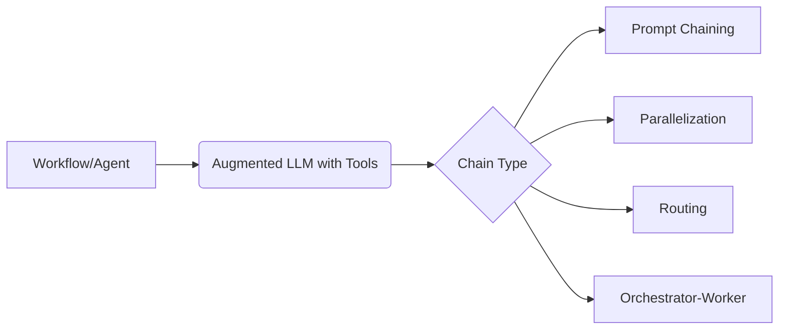

# LangGraph: Workflows and Agents

_Overview Diagram_

### 1. LangGraph Framework for Workflow Design

- It's best to treat agent creation as a system design problem and use **LangGraph** to define and improve the process.
- An **agent** is an LLM that directs its own actions based on feedback from its environment.
- In LangGraph, workflows can be explicitly defined for various patterns:
  - **Prompt Chaining:** A linear sequence of steps.
  - **Parallelization:** Running multiple tasks at once.
  - **Routing:** Directing a query to the appropriate tool or sub-agent based on its content.
  - **Orchestrator-Worker Architecture:** A supervisor agent that delegates tasks to specialized worker agents.

### 2. Framework Agnosticism

- LangGraph supports a wide variety of tools and LLMs, making it a flexible framework.
- It provides essential supporting infrastructure for production systems, including:
  - **Persistence:** Saving the state of a workflow.
  - **Human in the Loop:** Allowing for manual approval or intervention steps.
  - **Streaming:** Streaming results back to the user as they are generated.
  - **Deployment:** Tools to help deploy the agentic system.

### 3. Augmented LLM with Structured Outputs

- It is possible to augment an LLM to produce structured outputs (like JSON), which is crucial for reliable tool use.
- This is typically done by:
  1.  Creating a schema (e.g., a Pydantic model in Python).
  2.  Binding the schema to the LLM, instructing it to format its output according to that schema.

### 4. LLM with Chain of Thought (CoT)

- You can design an LLM to follow a **Chain of Thought** process to improve its reasoning.
- This involves breaking down a complex problem into smaller, sequential steps.
- For example, you could instruct an LLM to: "1. Make a joke. 2. Check the joke for quality. 3. Improve it twice."

### 5. LLM Agent with Tool Calling

- An agent is built by defining a set of **tools** it can use and giving these tools as possible **actions** to the LLM.
- The LLM then decides which tool to call based on the input.
- The output from the tool call is fed back to the LLM, which can then review this feedback to decide on the next step.

### 6. Tool Calling in Production: Workflows vs. Agents

- **Workflows** (more structured, predefined paths) are preferred for simple, predictable tasks where reliability is key.
- **Agents** (more autonomous, let the LLM decide the path) are better suited for more open-ended and complex tasks where the path to the solution isn't known in advance.

### Reference

- [Building Effective Agents with LangGraph](https://www.youtube.com/watch?v=aHCDrAbH_go) by [LangChain](https://www.youtube.com/@LangChain)
