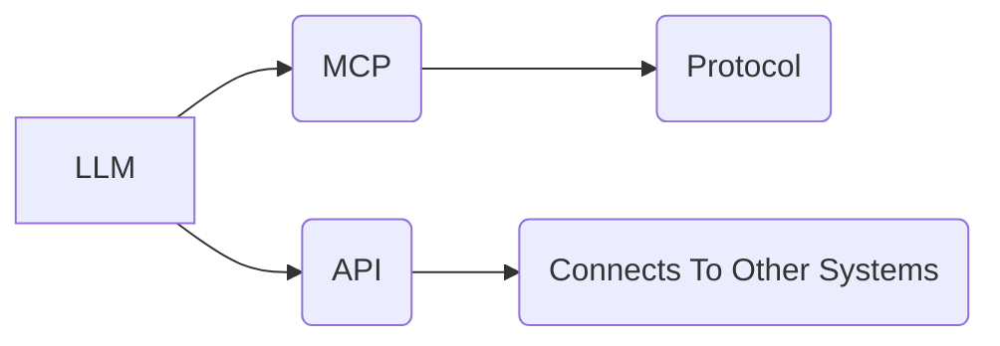

# Model Context Protocol (MCP)

_Overview Diagram_

### Introduction

- LLMs often need to interact with external data sources and services.
- Until recently, this interaction was typically done with Application Programming Interfaces (APIs).
- Anthropic introduced a new open standard protocol called Model Context Protocol (MCP).

### MCP vs API

- **MCP:** Standardizes how applications provide context to LLMs. Think of it like a USB-C port for AI applications.
- **API:** Lets one system access another system's functionality or data.

### MCP Architecture

- An MCP Host runs a number of MCP clients.
- Each client opens a JSON RPC 2.0 Session.
- It uses the MCP Protocol to connect to external MCP Servers.

### MCP Capabilities

MCP addresses two main needs of LLM applications:

1.  Provides contextual data.
2.  Enables the usage of tools by AI Agents.

### MCP Operation

- MCP helps with the long dependency problem by allowing an agent to store what it needs and forget what no longer applies.
- Use cases include querying a database, searching the web, calling an external service, or performing calculations.

### Similarities between MCP and APIs

- Both use a client-server model architecture.
- Both provide a layer of abstraction and simplify integration between systems.

### Differences between MCP and APIs

- **Purpose-Built vs. General Purpose:** MCPs are purpose-built for AI, whereas APIs are general purpose.
- **Dynamic Self-Discovery:** With MCP, agents can query a server at runtime to discover its capabilities. This allows an agent client to make use of new functionality without having to be reprogrammed. With a standard API, the client often needs to be reprogrammed to handle new features.

### Reference

[MCP vs API: Simplifying AI Agent Integration with External Data](https://www.youtube.com/watch?v=7j1t3UZA1TY) by [IBM Technology](https://www.youtube.com/@IBMTechnology)
