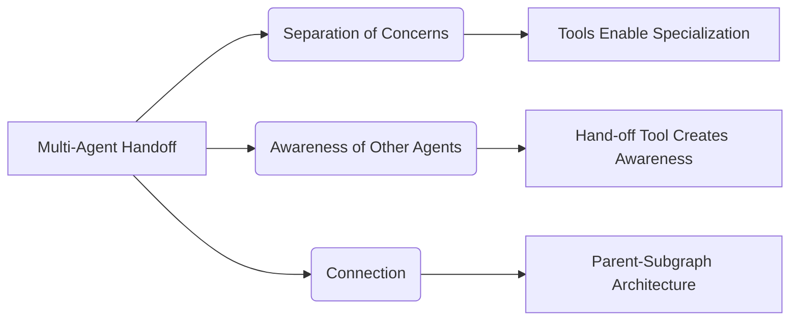

# Multi-Agent Handoffs in LangGraph

_Overview Diagram_

### Introduction

This note, based on a LangGraph example, explores how to manage handoffs between different specialized agents within a larger multi-agent system. The example uses a "swarm" with a flight booking assistant and a hotel booking assistant to illustrate the core concepts.

### Why Use Multi-Agent Systems?

- **Separation of Concerns:** This is the primary driver. Instead of one monolithic agent trying to handle many different tasks, you can design smaller, specialized agents.
- **Targeted Tools & Prompts:** Each agent can be given a narrow set of tools and a highly directed prompt, making it more reliable and efficient at its specific task (e.g., booking flights vs. booking hotels).

### Key Questions in Multi-Agent Handoffs

1.  How are agents aware of one another?
2.  How are the agents connected?
3.  How is control flow and state managed and updated?
4.  How do they share information?

### How are Agents Aware of One Another?

- **Tool-Based Handoff:** The primary mechanism for agent awareness is implementing handoffs as specialized tools that one agent can call to pass control to another.
- For example, the flight assistant agent is given a "handoff tool" that it can invoke to transfer the user's request to the hotel booking assistant. This tool explicitly makes one agent "aware" of another's existence and function.

### How are Agents Connected?

- **Parent-Subgraph Architecture:** LangGraph uses a hierarchical structure where a main "parent" graph orchestrates the workflow. Each specialized agent is its own "sub-graph."
- The parent graph is responsible for maintaining the global conversation state and tracking which agent is currently active.
- This architecture is highly modular; new agents (sub-graphs) can be added to the system without modifying the existing ones.

### How is State Updated?

- The parent graph's state includes an `active_agent` property.
- To hand off control, an agent's tool call updates the parent state, setting the `active_agent` to the name of the next sub-graph to run.
- The messages and context from the agent that just ran are added to the shared state, making them available for the next agent.

### How do They Share Information?

- **Shared State Key:** Each agent's sub-graph and the parent graph share a common state key, typically `messages`. This allows the conversation history to be propagated and accessible to whichever agent is currently active.
- The overall state object (`SwarmState`) extends the base message state with the `active_agent` property to manage the control flow.

### Reference

[Understanding Multi-agent Handoffs](https://www.youtube.com/watch?v=WTr6mHTw5cM) by [LangChain](https://www.youtube.com/@LangChain)
