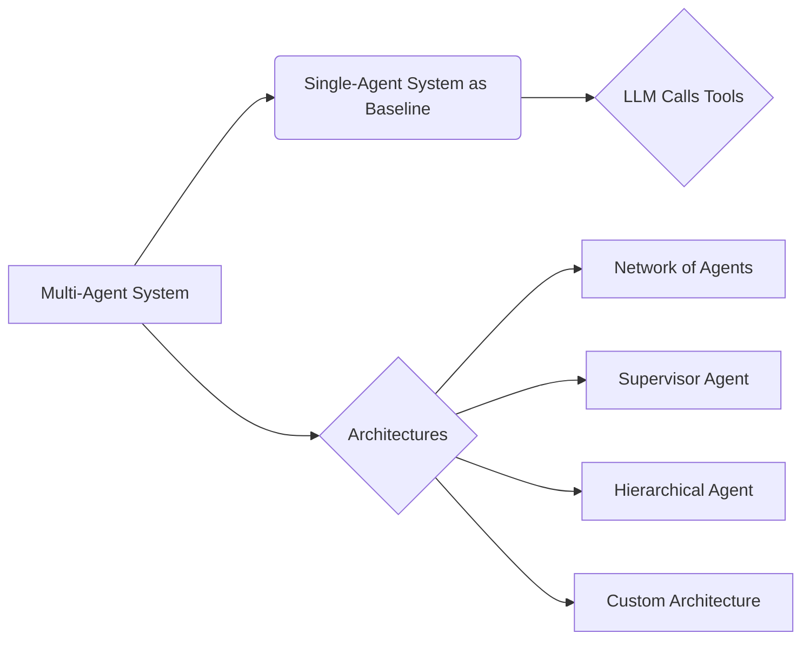

# Multi-Agent Systems

_Overview Diagram_

### Key Points

- LangGraph is a framework that can be used to build agentic systems, including both single-agent and multi-agent systems.
- Multi-agent systems represent an evolution from simpler, single-agent designs.

### Single-Agent Systems

- A single-agent system consists of a single LLM that calls multiple tools to accomplish a task.
- **Limitations:**
  - These systems can struggle as the complexity of the task and the number of available tools increase.
  - Performance often degrades when an agent has to manage more than 5-10 tools, as the LLM has difficulty choosing the correct tool from a large set.

### Multi-Agent Systems

- A multi-agent system divides a complex task among several specialized agents, each with a focused set of tools and responsibilities.
- **Benefits:**
  - **Modularity:** Specialized agents are easier to develop, test, and maintain.
  - **Improved Performance:** By limiting the scope of each agent, the system can handle more complex workflows more reliably.
  - **Controlled Communication:** You can explicitly define the communication patterns between agents.

### Common Multi-Agent Architectures

- **Network of Agents:**
  - Agents can communicate freely with one another.
  - This architecture is often unreliable and expensive due to the high number of LLM calls required for coordination. It is generally not recommended.

- **Supervisor Agent:**
  - A central "supervisor" or "orchestrator" agent routes tasks to the appropriate sub-agents.
  - Sub-agents are specialized and focus only on their given tasks.
  - This is a more manageable and common pattern.

- **Hierarchical Agents:**
  - This architecture builds layers of supervised agents, creating a tree-like command structure.
  - It's useful for breaking down very complex problems into sub-problems.

- **Custom Architectures:**
  - Designs that are tailored for a specific domain or problem, often combining elements of other architectures.

### Agent-to-Agent Communication

There are two primary methods for agents to share information:

1.  **Shared State Object:**
    - All agents have access to a common "state" object.
    - They can read from and write to this shared state, allowing for broad awareness of the overall progress.

2.  **Tool Calling:**
    - Agents communicate by calling each other as if they were tools.
    - Parameters are passed explicitly through these tool calls.
    - In this model, agents do not have access to each other's internal state, making communication more explicit and controlled.

_Source:_
[Conceptual Guide: Multi Agent Architectures](https://www.youtube.com/watch?v=4nZl32FwU-o) by [LangChain](https://www.youtube.com/@LangChain)
