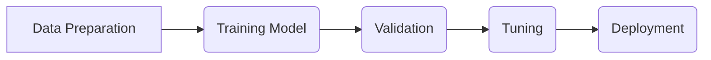

# Workflow to Create an AI Model

_Overview Diagram_

### Stage 1: Prepare the Data

This stage involves gathering and processing the massive datasets required for training.

- Combines both open-source and proprietary data, potentially scaling to petabytes.
- Key data processing tasks include:
  - **Categorization:** Describing the data, such as identifying languages or code types.
  - **Filtering:** Removing unwanted content like hate speech, copyrighted material, or sensitive information.
  - **Deduplication:** Removing duplicate data to improve efficiency.
- The output is a versioned and tagged base data pile, which is crucial for governance and reproducibility.

### Stage 2: Train the Model

This is the core training phase where the model learns from the prepared data.

- Begins with selecting a suitable foundation model (e.g., generative, encoder-only, lightweight) based on the intended use case.
- The data pile is tokenized, as foundation models process data in tokens rather than raw words.
- Training is a computationally intensive and lengthy process, potentially taking months and requiring significant resources.

### Stage 3: Validate

This stage involves rigorously benchmarking the model to ensure it meets quality standards.

- The trained model's performance is assessed against predefined quality benchmarks.
- A "model card" is created, which is a document detailing the model's architecture, training data, and benchmark scores.
- This stage is primarily handled by data scientists and AI researchers.

### Stage 4: Tune

In this stage, the model is refined and adapted for specific applications.

- Application developers, who are not necessarily AI experts, interact with the model.
- They generate prompts and fine-tune the model with additional, domain-specific data to enhance its performance for their particular use case.
- This stage is significantly faster than the initial training, typically taking hours or days.

### Stage 5: Deploy

The final stage involves making the tuned model available for use.

- The model can be deployed as a service in a public cloud.
- Alternatively, it can be embedded directly into an application, potentially running closer to the user at the network edge.
- Once deployed, the model can be continuously monitored and improved through further iterations of this workflow.

### Reference

- [Five Steps to Create a New AI Model](https://www.youtube.com/watch?v=jcgaNrC4ElU) by [IBM Technology](https://www.youtube.com/@IBMTechnology)
