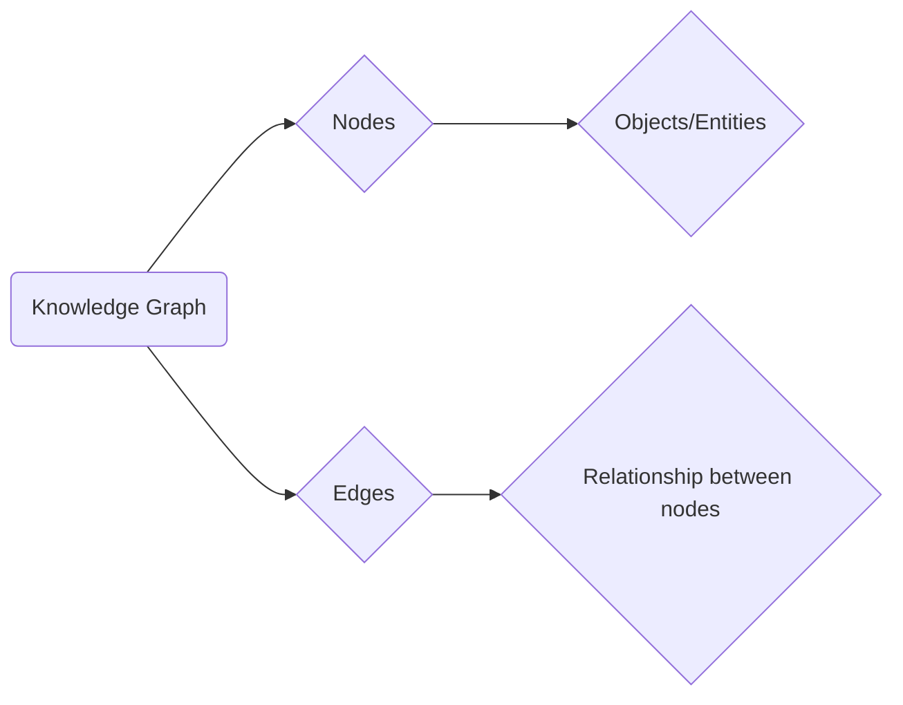

# Knowledge Graphs

_Overview Diagram_

### What is a Knowledge Graph?

A knowledge graph is a way to represent a network of real-world entities (like objects, people, or concepts) and the relationships between them. It allows machines to understand not just the entities themselves, but how they are connected and what attributes they share. This structured understanding enables more advanced reasoning and inference compared to traditional data models.

### Nodes and Edges

A knowledge graph has two primary components:

- **Nodes (or Vertices):** These represent the entities or objects. A node could be a person ("Tom Hanks"), a movie ("Forrest Gump"), a concept ("acting"), or a place.
- **Edges (or Relationships):** These define how the nodes are related to each other. An edge has a direction and a label describing the relationship. For example, an edge could connect "Tom Hanks" to "Forrest Gump" with the label "acted in."

A single pair of nodes can be connected by multiple edges if they are related in more than one way.

### Leveraging Knowledge Graphs

Knowledge graphs are powerful because they can integrate information from various data sources and use it to infer new, missing facts. For example, if a graph knows that:

1.  "Tom Hanks" starred in "Cast Away."
2.  "Cast Away" is a "Drama" film.

The system can infer that "Tom Hanks" is an actor who has performed in dramas, even if that fact isn't explicitly stated.

### Natural Language Processing (NLP)

Knowledge graphs often rely on Natural Language Processing (NLP) to be built automatically from unstructured text. NLP techniques are used to read documents, identify key entities (Named Entity Recognition), and extract the relationships between them. This process turns vast amounts of unstructured text into a structured, queryable knowledge graph.

### Commercial Applications

Knowledge graphs are used in a wide range of commercial applications to provide context and drive intelligent features:

- **Recommendation Engines:** Recommending products, movies, or content by understanding the relationships between items and user preferences.
- **Search Engines:** Enhancing search results by understanding the user's intent and the context of the query (e.g., Google's Knowledge Panel).
- **Insurance:** Analyzing relationships between claims, individuals, and policies to detect potential fraud.
- **Retail:** Understanding how different products are related to provide better recommendations and manage inventory.

### Reference

[What is a Knowledge Graph?](https://www.youtube.com/watch?v=y7sXDpffzQQ) by [IBM Technology](https://www.youtube.com/@IBMTechnology)
