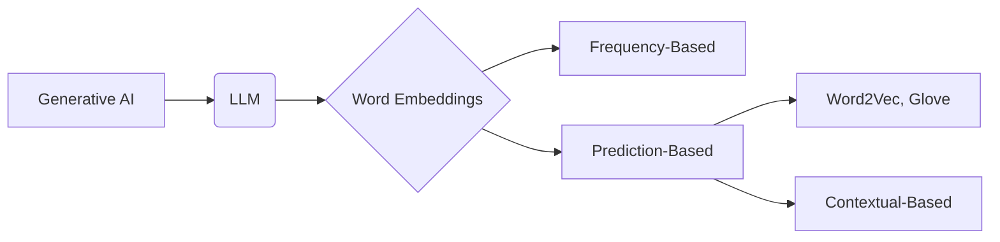

# Language Concept Models (LCM)

_Overview Diagram_

### Core Concept

Language Concept Models (LCMs) are an approach designed to improve the performance and reasoning capabilities of Large Language Models (LLMs). While traditional language models focus on predicting the next word in a sequence, LCMs aim to operate on a higher level of abstraction, enabling more sophisticated understanding and generation.

### Data Representation and Abstraction

- Like LLMs, LCMs transform data (text, images, audio) into numerical vectors to mathematically understand relationships.
- The key difference is that LCMs work to "denoise" the input, moving from low-level tokens (like individual words) to higher-level concepts.
- This is achieved by influencing how the decoder part of a model pays attention to the encoded input, focusing on broader ideas rather than just word-by-word sequences. This provides a foundation for a higher level of reasoning.

### Key Features

- **Improved Reasoning:** By working with concepts instead of just tokens, LCMs can achieve a more robust understanding of the input, leading to better problem-solving and generation.
- **Modality Agnostic:** The conceptual approach allows LCMs to handle various types of data, including text, sounds, and images, within a unified framework.
- **Zero-Shot Generation:** Because LCMs learn underlying concepts, they are better equipped to handle tasks and generate content for scenarios they haven't been explicitly trained on (zero-shot generation).

### Embedding Types

The foundation of this conceptual understanding lies in how words and data are represented as vectors (embeddings). LCMs build upon the evolution of these techniques:

- **Frequency-Based Embeddings:** The simplest form, based on word counts. They lack predictive power and contextual understanding.
- **Prediction-Based Embeddings:** More advanced models that predict word positioning in vector space, capturing semantic relationships. Examples include Word2Vec, GloVe, and BERT.
- **Contextual Embeddings:** The representation of a word changes based on its surrounding context, allowing for a nuanced understanding of meaning. LCMs leverage this to build their conceptual framework.

### Reference

[Language Concept Models: The Next Leap in Generative AI](https://www.youtube.com/watch?v=Le86PMGK2Uk) by [IBM Technology](https://www.youtube.com/@IBMTechnology)
