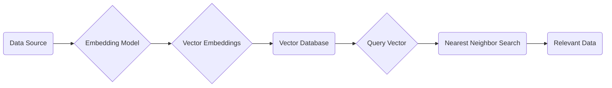

# Vector Databases

_Overview Diagram_

### The Semantic Gap

Traditional relational databases store data using binary representations, metadata, and tags. They are excellent for exact queries (e.g., `SELECT * WHERE color = 'orange'`) but struggle with semantic or similarity-based searches. This disconnect between how computers store data and how humans understand nuanced concepts is known as the **Semantic Gap**.

### What are Vector Databases?

Vector databases are designed to bridge the semantic gap by representing data as high-dimensional numerical vectors, also known as **embeddings**. These embeddings capture the semantic meaning of the data, allowing for powerful similarity searches.

- **Core Principle:** Similar items are located near each other in the vector space, while dissimilar items are positioned far apart.
- **Functionality:** They transform unstructured data (like images, text, or audio) into vector embeddings and perform efficient similarity searches using mathematical operations.

### How Vector Embeddings Work

Specialized embedding models are used to convert different types of data into vector embeddings.

1.  **Feature Extraction:** The input data is passed through multiple layers of a neural network. Each layer extracts progressively more abstract and complex features.
2.  **Vector Representation:** The final output is a high-dimensional vector (an array of numbers) where each position in the array represents a learned feature. This vector is the data's semantic fingerprint.

### How Vector Indexing Works

Searching for the exact closest vector in a high-dimensional space can be slow. To solve this, vector databases use **Approximate Nearest Neighbor (ANN)** algorithms.

- **Vector Indexing:** These algorithms efficiently find vectors that are highly likely to be among the closest matches without having to compare the query vector to every single vector in the database.
- **Common ANN Algorithms:**
  - **HNSW (Hierarchical Navigable Small World):** Creates a multi-layered graph structure to speed up searches.
  - **IVF (Inverted File Index):** Clusters vectors and searches only within the most relevant clusters.

### Use Cases

Vector databases are a core component of modern AI applications, particularly in **Retrieval-Augmented Generation (RAG)** systems. In a RAG architecture, the vector database stores embeddings of document chunks, articles, and other knowledge bases, allowing an LLM to retrieve semantically relevant context to answer user queries accurately.

### Reference

[What is a Vector Database? Powering Semantic Search & AI Applications](https://www.youtube.com/watch?v=gl1r1XV0SLw) by [IBM Technology](https://www.youtube.com/@IBMTechnology)
