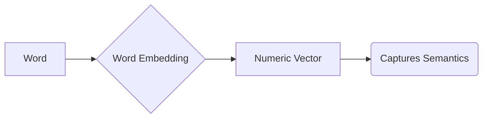

# Word Embeddings

_Overview Diagram_

### Introduction

- Word embeddings represent words as numeric vectors in a way that captures their semantic relationships and contextual information.
- Words with similar meanings are positioned close to each other in vector space.

### Why Use Word Embeddings?

- Machine learning algorithms cannot process plain text in its raw form.
- Word embeddings allow machines to understand relationships between words by converting them into a numerical format.

### Applications

Word embeddings are a fundamental tool in NLP (Natural Language Processing) and are used in tasks such as:

- Text classification
- Named Entity Recognition (NER)
- Word similarity analysis
- Question-answering systems

### How They Work

1.  **Text Pre-processing:** Includes tokenization and removing stop words.
2.  **Identify Target and Context:** A sliding context window identifies target words and the words surrounding them (context).
3.  **Model Training:** The model is trained to predict target words based on their context, adjusting the vectors to position similar words closer together.
4.  **Model Parameter Adjustment:** The model's parameters are adjusted iteratively to minimize prediction errors throughout the training process.

### Embedding Methods

- **Frequency-Based:** These embeddings are derived from the frequency of words in a corpus.
  - An example is **TF-IDF** (Term Frequency-Inverse Document Frequency).

- **Prediction-Based:** These capture semantic relationships and contextual information between words.
  - **Word2Vec:** Developed by Google, it has two primary architectures:
    - **CBOW (Continuous Bag of Words):** Predicts a target word based on its surrounding context words.
    - **Skip-gram:** Predicts context words, given a single target word.
  - **GloVe (Global Vectors for Word Representation):** Created at Stanford University, it uses co-occurrence statistics to create word vectors.

- **Contextual-Based:**
  - The representation of a word changes based on its surrounding context, which helps capture nuances in meaning.
  - This is often achieved through **Transformer models** like BERT.

### Reference

[What are Word Embeddings?](https://www.youtube.com/watch?v=wgfSDrqYMJ4) by [IBM Technology](https://www.youtube.com/@IBMTechnology)
