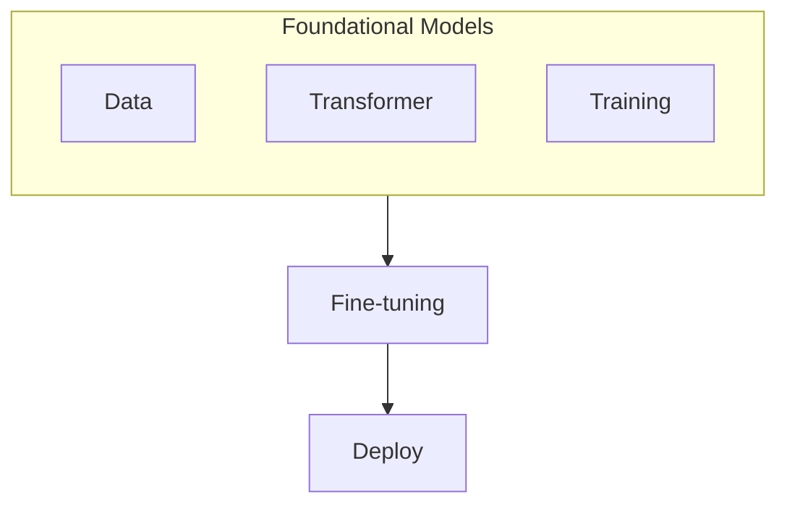

# Foundation Models and NASA

_Overview Diagram_

### Introduction

- Many Foundation Models are available for download on the open-source website “Hugging Face”.
- This raises the question of why there are so many Foundation Models.

### Defining Foundation Models

- Foundation models are large-scale neural networks trained on vast amounts of data.
- They serve as the foundation for many applications.
- Information learned in one situation can be applied to other, new, untrained situations. This is called “transfer learning.”
- Models can be taught new tasks with limited sets of hand-labelled examples.

### NASA and Data

- If you are looking for huge amounts of data, look no further than NASA.
- By 2030, NASA is expected to be closer to 300 petabytes of Earth science data, captured from satellite images.

### The Transformer

- Underpinning all Foundation Models is the concept of a “Transformer.”
- A Transformer is an AI architecture that can turn heaps of raw data (text, audio, satellite imagery) into a compressed representation that captures the data’s basic structure.

### How Foundation Models Help

- Traditionally, analyzing satellite data has been a tedious process due to the time required for human experts to annotate features.
- Foundation models can cut out much of this manual effort by extracting the structure of raw images.

### Fine-tuning and Task Diversification

- Foundation Models have been fine-tuned to allow users to map the extent of past US floods and wildfires.
- These measurements can be used to predict future areas of risk.
- With additional fine-tuning, flood and wildfire prediction models can be redeployed for tasks like:
  - Tracking deforestation.
  - Predicting crop yields.
  - Detecting/Monitoring greenhouse gases.
- By selecting the right foundation model and adapting it, the model can be used to meet different needs.

### Reference

[Why Are There So Many Foundation Models?](https://www.youtube.com/watch?v=QPQy7jUpmyA) by [IBM Technology](https://www.youtube.com/@IBMTechnology)
