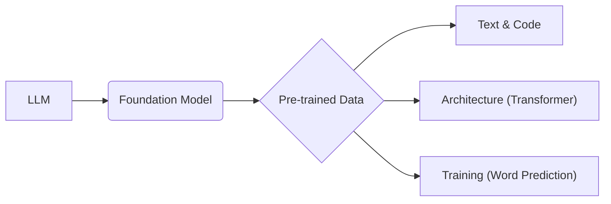

# Large Language Models (LLMs)

_Overview Diagram_

### What is a Large Language Model?

- An LLM is a specific instance of a **Foundation Model**.
- Foundation Models are pre-trained on vast amounts of unlabeled data using self-supervised learning. The model learns from patterns in the data to produce generalizable and adaptable output.
- LLMs are foundation models that are specifically trained on massive datasets of text and text-like data (such as code).
- The term "large" refers to both the size of the training data (petabytes) and the number of parameters in the model (billions).
  - For scale, 1 PB (petabyte) is equal to 1 million GB.
  - GPT-3, for example, was trained on a 45 TB corpus of text and has 175 billion parameters.

### How do LLMs work?

An LLM can be broken down into three core components: Data + Architecture + Training.

- **Data:** As described above, this is a massive corpus of text and code from sources like books, articles, websites, and conversations.

- **Architecture:** The underlying structure of an LLM is a **Neural Network**. For most modern LLMs, including the GPT family, the specific architecture used is the **Transformer**. The Transformer architecture is highly effective at handling sequences of data (like sentences) because its "attention mechanism" allows it to weigh the importance of different words in a sequence to understand context.

- **Training:**
  1.  The primary training objective is to **predict the next word** in a sequence. For example, given the phrase "The sky is...", the model learns to predict "blue".
  2.  The model begins by making random guesses. With each iteration, it adjusts its internal parameters (weights and biases) to minimize the difference between its predictions and the actual words in the training data.
  3.  This process is repeated billions of times until the model can reliably generate coherent and contextually relevant text.
  4.  After pre-training, an LLM can be **fine-tuned** on a smaller, more specific dataset to specialize its capabilities for a particular task, such as customer service or medical text analysis.

### Business Applications

LLMs have a wide range of applications across various industries:

- **Customer Service:** Powering intelligent chatbots and virtual assistants that can understand and respond to user queries in natural language.
- **Content Creation:** Generating articles, marketing copy, emails, social media posts, and even creative scripts.
- **Software Development:** Assisting with code generation, code completion, and reviewing code for potential errors.

### Reference

[How Large Language Models Work](https://www.youtube.com/watch?v=5sLYAQS9sWQ) by [IBM Technology](https://www.youtube.com/@IBMTechnology)
