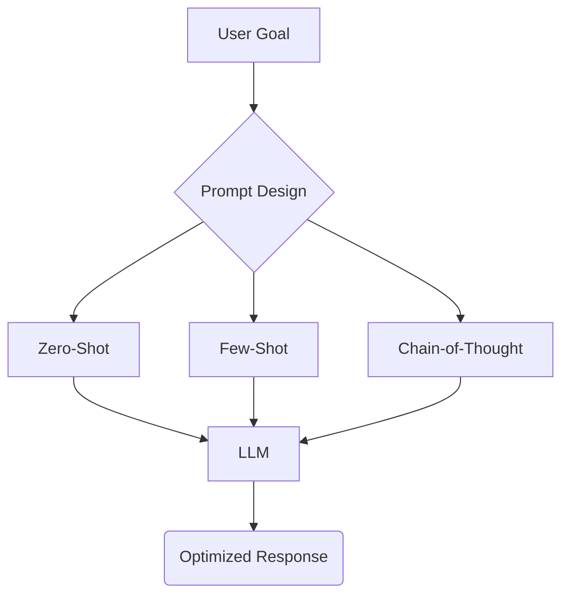

# Prompt Engineering Techniques

_Overview Diagram_



### What is Prompt Engineering?

Prompt engineering is the art and science of designing effective inputs (prompts) to guide Large Language Models (LLMs) toward generating specific, accurate, and desired outputs. Since the behavior of an LLM is highly sensitive to its input, carefully crafting the prompt is crucial for maximizing its performance and reliability.

### 1. Zero-Shot Prompting

This is the most basic form of prompting, where you ask the LLM a question or give it a task directly, without providing any examples. The model must rely entirely on its pre-existing, generalized knowledge from its training data to generate a response.

- **How it works:** A single, direct instruction is given.
- **Example:** `"Translate the following English text to French: 'Hello, how are you?'"`
- **Limitation:** This can lead to suboptimal or ambiguous responses if the task is complex or the terminology is vague. The model may have to guess the user's intent.

### 2. Few-Shot Prompting

Few-shot prompting involves providing the LLM with one or more examples of the desired input-output format within the prompt itself. This gives the model context and a clear pattern to follow, significantly improving its performance on specific tasks.

- **How it works:** The prompt includes examples that demonstrate the task before the final query is made.
- **Example:**

  ```
  Translate English to French.

  English: "sea otter"
  French: "loutre de mer"

  English: "cheese"
  French: "fromage"

  English: "What is your name?"
  French:
  ```

- **Benefit:** By showing the model how to respond, you constrain its possible outputs and guide it toward the correct format and style. This has been shown to improve the model's reasoning capabilities.

### 3. Chain-of-Thought (CoT) Prompting

Chain-of-Thought is an advanced prompting technique that encourages the LLM to "think step-by-step." Instead of asking for an immediate answer, you ask the model to first explain its reasoning process and then provide the final answer.

- **How it works:** The prompt is structured to ask for a series of reasoning steps leading to the conclusion. This is often combined with few-shot prompting.
- **Example:**

  ```
  Q: Roger has 5 tennis balls. He buys 2 more cans of tennis balls. Each can has 3 tennis balls. How many tennis balls does he have now?

  A: Roger started with 5 balls. 2 cans of 3 tennis balls each is 6 tennis balls. 5 + 6 = 11. The answer is 11.

  Q: A juggler can juggle 16 balls. Half of the balls are golf balls, and half of the golf balls are blue. How many blue golf balls are there?

  A:
  ```

  (The model will then generate the reasoning: "There are 16 balls. Half are golf balls, so 16 / 2 = 8 golf balls. Half of those are blue, so 8 / 2 = 4 blue golf balls. The answer is 4.")

- **Benefits:**
  - **Improved Accuracy:** CoT significantly improves performance on tasks requiring logical, arithmetic, or multi-step reasoning.
  - **Explainable AI (XAI):** It provides insight into the LLM's "thinking" process, making the results more transparent and easier to debug if the final answer is incorrect.

### Reference

[Large Language Models Are Zero Shot Reasoners](https://www.youtube.com/watch?v=T-w_5T-j-dA) by [IBM Technology](https://www.youtube.com/@IBMTechnology)
