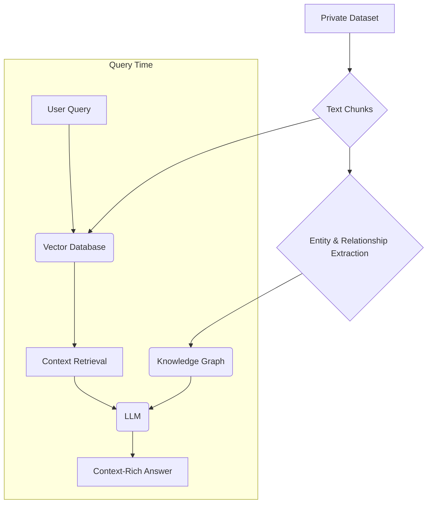

# Graph RAG: Answering Complex Multi-Hop Questions

_Overview Diagram_

### Introduction to Graph RAG

Graph Retrieval-Augmented Generation (Graph RAG) is an advanced RAG technique that enhances standard retrieval by constructing and querying a **knowledge graph**. While traditional RAG retrieves isolated text chunks based on semantic similarity, Graph RAG understands and leverages the _relationships_ between different pieces of information. This allows it to answer complex, multi-hop questions with greater accuracy and provide more comprehensive, context-rich answers.

This approach is particularly valuable in domains like healthcare, finance, or compliance, where understanding the connections between data points is critical for making informed decisions.

### How Graph RAG Works

Graph RAG builds upon the standard RAG pipeline by adding a knowledge graph creation step during indexing.

1.  **Traditional RAG Indexing:** A collection of private documents (both structured and unstructured) is loaded and split into smaller text chunks. These chunks are then converted into vector embeddings and stored in a vector database for semantic search.

2.  **Graph RAG's Enhancement (Knowledge Graph Creation):**
    - In addition to creating embeddings, Graph RAG processes the text chunks to **extract key entities** (e.g., people, organizations, concepts) and the **relationships** that connect them.
    - This structured information is then used to build a knowledge graph, where entities are represented as **nodes** and their relationships as **edges**.

3.  **Querying and Generation:**
    - When a user submits a query, the system performs retrieval from the vector database as usual.
    - However, it also leverages the knowledge graph to understand the deeper context and connections between the retrieved information.
    - The LLM receives both the raw text chunks _and_ the structured context from the graph, allowing it to generate a more insightful and accurate response.

### Example: Understanding Deeper Context

Consider the sentence: _"An immunologist discussed virus response strategies with the CEO of a healthcare company."_

- **Traditional RAG** would retrieve this sentence if it's relevant to a query but would treat "immunologist" and "CEO" as separate, co-occurring terms.
- **Graph RAG** goes further by understanding and mapping the relationships:
  - It connects the `immunologist` node to the broader concept of `immunology` and `medical research`.
  - It links the `CEO` node to the `healthcare company` node.
  - It establishes a `discussed` relationship between the `immunologist` and the `CEO` nodes, with the topic being `virus response strategies`.

This structured understanding allows the system to answer more nuanced questions, such as "What kind of experts are involved in shaping a healthcare company's strategy on viruses?" by traversing the graph.

### Key Benefits of Graph RAG

- **Higher Accuracy & More Complete Answers:** By understanding the relationships between concepts, Graph RAG provides answers that are not just factually correct but also contextually complete.
- **Easier Maintenance and Development:** Once the knowledge graph is built, it can be easier to maintain and update the relationships between data points compared to managing thousands of isolated text chunks.
- **Enhanced Explainability and Governance:** The graph structure makes it easier to trace the reasoning path of the LLM, improving transparency. It also allows for more granular access controls to be applied at the node or edge level, enhancing data governance.

### Reference

- [GraphRAG vs. Traditional RAG: Higher Accuracy & Insight with LLM - YouTube](https://www.youtube.com/watch?v=Aw7iQjKAX2k) by [IBM Technology](https://www.youtube.com/@IBMTechnology)
