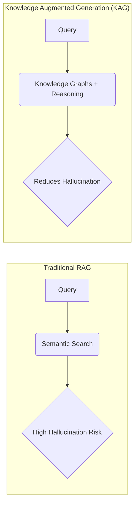

# KAG: Knowledge Augmented Generation

_Overview Diagram_

### KAG Introduction

Knowledge Augmented Generation (KAG) is presented as the next evolution in professional domain AI, aiming to move beyond the limitations of traditional Retrieval-Augmented Generation (RAG) and Graph RAG.

**Key Benefits of KAG:**

- Transforms your domain knowledge into a structured, understandable framework.
- Integrates new knowledge in real-time.
- Achieves professional-grade accuracy, especially for complex queries.
- Reduces time spent on data discovery, allowing more time for strategic decisions.

### RAG Limitations vs. KAG Capabilities

| Feature                    | Past Limitations (Traditional RAG)  | Present Capabilities (KAG)              |
| :------------------------- | :---------------------------------- | :-------------------------------------- |
| **Knowledge Sources**      | Fragmented, unstructured sources    | Unified, structured knowledge framework |
| **Reasoning Capabilities** | Limited logical reasoning           | Enhanced, multi-hop logical reasoning   |
| **Query Accuracy**         | High error rates in complex queries | Professional-grade accuracy             |

### The KAG Advantage

KAG provides multiple benefits through a single, integrated framework:

1.  **Knowledge Integration:** Unifies disparate data sources.
2.  **Logical Reasoning:** Enables the system to infer connections and answer complex questions.
3.  **Professional Results:** Delivers accurate and reliable answers.

### How to Implement KAG

The implementation process involves three main steps:

1.  Define the scope of the domain knowledge.
2.  Connect the relevant data sources.
3.  Deploy the KAG framework to build the knowledge graph and enable querying.

### Technical Deep Dive

KAG is formally defined as a framework that combines:

- **Open Information Extraction (OpenIE):** To extract structured information from unstructured text.
- **Knowledge Graphs (KGs):** To represent entities and their relationships.
- **Advanced Multi-hop Reasoning:** To traverse the knowledge graph and find answers to complex queries that require connecting multiple pieces of information.

#### KAG Technical Architecture

1.  **Index Construction:**
    - Documents are processed via semantic chunking.
    - Information is extracted and aligned within the input documents.
    - This structured information is used to build a comprehensive Domain Knowledge Graph.

2.  **Question Answering:**
    - The system uses **Logic Symbol Guided Reasoning** to navigate the graph.
    - A hybrid retrieval system combines graph traversal with traditional vector search.
    - It includes a document fallback strategy for queries that don't map well to the graph.

### Why KAG is an Improvement Over RAG

Traditional RAG systems rely primarily on **semantic search** over a vector database. This can be effective for simple queries but often struggles with:

- **Hallucination:** If the system fails to retrieve relevant information, it may invent an answer.
- **Complexity:** It cannot easily answer questions that require synthesizing information from multiple documents or understanding complex relationships.

KAG addresses this by creating a structured Knowledge Graph first, allowing the system to reason over the data rather than just matching semantic similarity.

### Reference

[KAG Framework SMASHES GraphRAG in Accurate Knowledge Generation](https://www.youtube.com/watch?v=TnTH85-jobE) by [Mervin Praison](https://www.youtube.com/@MervinPraison)
