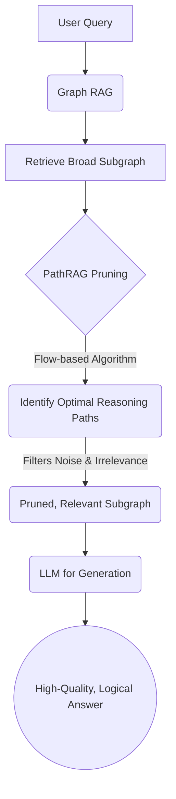

# PathRAG: Pruning Graph-based RAG for Better Reasoning

_Overview Diagram_

### Introduction

While Graph-based RAG methods improve upon simple vector search by leveraging relationships within data, they often suffer from a significant drawback: **information overload**. When retrieving data, they can pull in excessively large and noisy subgraphs. This floods the Large Language Model (LLM) with irrelevant information, leading to increased token consumption, higher computational costs, and lower-quality, less logical responses.

**PathRAG** is a novel approach designed to solve this problem by intelligently pruning the retrieved knowledge graph _before_ it's sent to the LLM.

### The Core Problem with Standard Graph RAG

- **Noise and Irrelevance:** Standard Graph RAG might retrieve an entire cluster of connected nodes, even if only a small, direct path between two key entities is needed to answer a query.
- **Increased Cognitive Load for LLM:** Forcing the LLM to sift through a large, noisy graph to find the "golden path" of reasoning is inefficient and can degrade its performance.
- **Higher Costs:** Larger contexts mean more tokens are processed, increasing API costs and latency.

### How PathRAG Works: Flow-Based Pruning

PathRAG introduces a crucial intermediate step that filters the retrieved subgraph to find the most relevant "reasoning paths."

1.  **Initial Retrieval:** Like other Graph RAG methods, it starts by identifying relevant entities from the query and retrieving an initial, broad subgraph from the knowledge graph.
2.  **Path Identification:** It then analyzes this subgraph to find all possible paths connecting the key entities.
3.  **Flow-Based Pruning Algorithm:** This is the core innovation. PathRAG uses a "flow-based" algorithm that assigns **distance and reliability scores** to each path. This allows it to:
    - Prioritize shorter, more direct connections.
    - Identify the most semantically coherent and logical reasoning paths.
    - Discard irrelevant nodes and edges that add noise but no value.
4.  **Final Context:** The final output is a lean, pruned subgraph containing only the most critical information paths. This optimized context is then passed to the LLM for generation.

### Key Benefits of PathRAG

- **Reduced Noise:** By filtering out irrelevant data, PathRAG provides the LLM with a clean, focused context.
- **Improved Answer Quality:** The LLM can generate more logical and higher-quality responses because it is working with a pre-filtered, coherent reasoning structure.
- **Greater Efficiency:** Smaller, more relevant contexts lead to lower token consumption, reduced latency, and lower costs.
- **Enhanced Semantic Understanding:** The pruning process inherently improves the system's ability to understand the semantic relationships needed to answer a specific query.

### A Word of Caution in Professional Domains

It's important to note that while advanced RAG techniques like PathRAG significantly improve accuracy, they are not infallible. Research from institutions like MIT, Stanford, and Duke has highlighted the risks of using RAG systems in critical domains like medicine, where they can still generate subtly misleading information if the underlying data or retrieval logic has flaws. Continuous evaluation and human oversight remain essential.

### Reference

[Graph RAG Evolved: PathRAG (Relational Reasoning Paths)](https://www.youtube.com/watch?v=oetP9uksUwM) by [Discover AI](https://www.youtube.com/@discoverai1)
