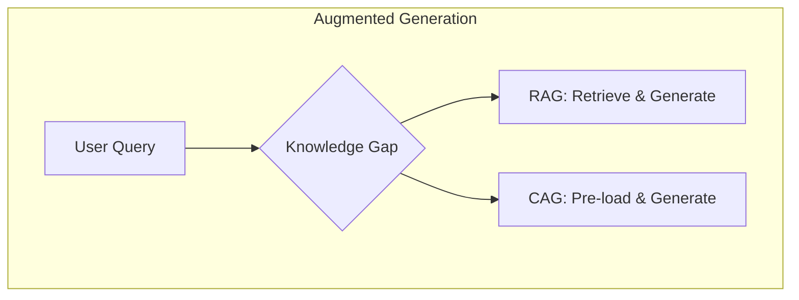
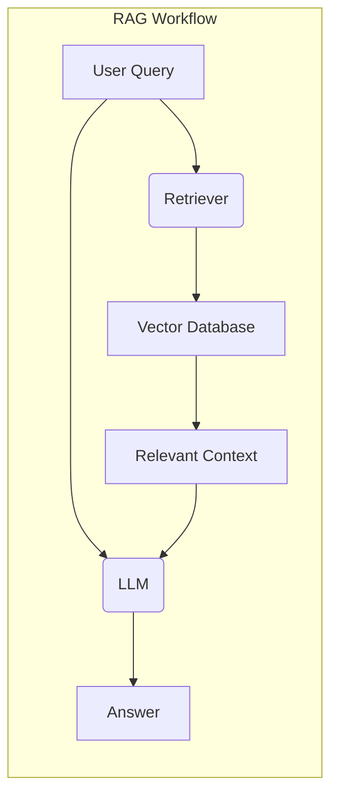
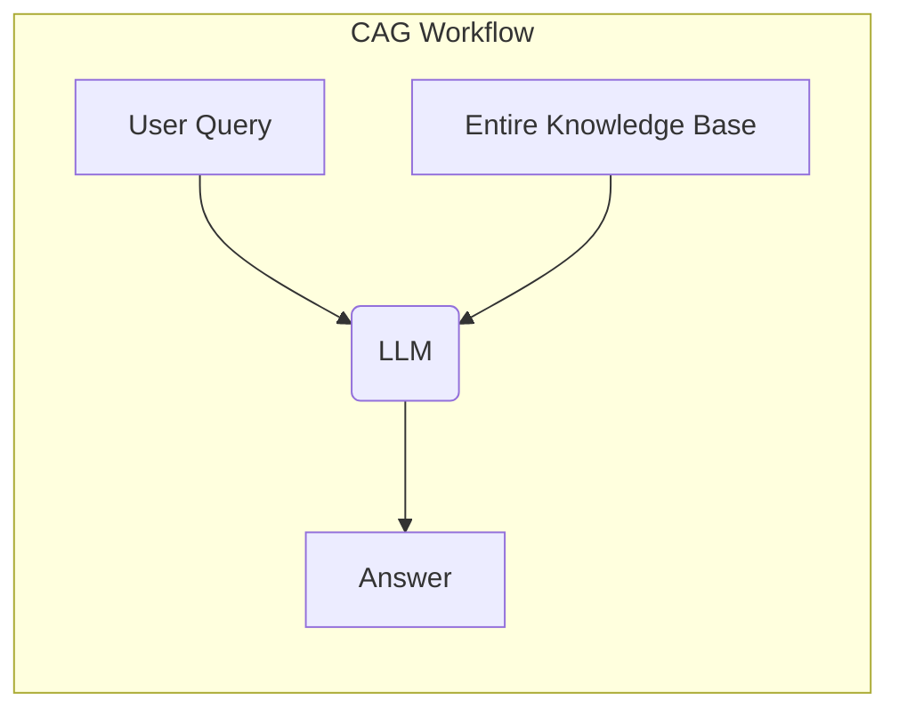

# RAG vs. CAG: Solving Knowledge Gaps in AI Models

_Overview Diagram_

### The "Knowledge Problem" of LLMs

Large Language Models (LLMs) have a "knowledge problem": if a piece of information was not in their vast training data, they are unable to recall it. This includes recent events, breaking news, or proprietary data like a specific company's internal documents or a customer's purchase history.

**Augmented Generation** is a set of techniques designed to solve this problem by providing the LLM with external, up-to-date information at the time of the query. Two prominent methods are Retrieval-Augmented Generation (RAG) and Cache-Augmented Generation (CAG).

### Retrieval-Augmented Generation (RAG)

RAG enhances the generation process by first retrieving relevant information from an external, searchable knowledge base (like a vector database).

**How RAG Works:**

1.  A user's query is used to search a knowledge base.
2.  The knowledge base returns relevant documents or data chunks that provide additional context.
3.  The LLM uses both the original query and the retrieved context to generate a well-informed answer.

### Cache-Augmented Generation (CAG)

Instead of searching a database in response to a query, CAG preloads the _entire_ knowledge base directly into the model's context window.

**How CAG Works:**

1.  All relevant information from the knowledge base is loaded ("cached") into the LLM's context window at the start of the session.
2.  The model then uses this comprehensive, in-context information to generate an answer to the user's query.

### RAG vs. CAG: A Comparison

| Feature            | RAG                                                                                                    | CAG                                                                                                                     |
| :----------------- | :----------------------------------------------------------------------------------------------------- | :---------------------------------------------------------------------------------------------------------------------- |
| **Accuracy**       | Dependent on the quality of the retriever. Can fail if the retriever doesn't find the right documents. | Relies entirely on the model's ability to find the relevant information within its context window.                      |
| **Latency**        | Higher, as it involves an extra network hop to query the external database.                            | Lower, as all information is already loaded. No external query is needed at runtime.                                    |
| **Scalability**    | Scales well to very large knowledge bases, as it only retrieves small, relevant chunks.                | Limited by the size of the model's context window. Not suitable for very large datasets.                                |
| **Data Freshness** | Easy to keep fresh. You only need to update the documents in the knowledge base and re-index them.     | Harder to keep fresh. The entire knowledge base must be re-loaded (re-computed) into the context window for any update. |

### Conclusion

- **RAG** is ideal for applications with very large, dynamic knowledge bases where low latency is not the absolute priority.
- **CAG** is better suited for smaller, more static datasets where speed is critical and the entire knowledge base can fit within the model's context window.

### Reference

- [RAG vs. CAG: Solving Knowledge Gaps in AI Models](https://www.youtube.com/watch?v=HdafI0t3sEY) by [IBM Technology](https://www.youtube.com/@IBMTechnology)
