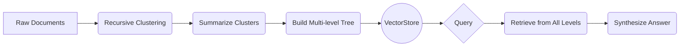

# RAPTOR: Recursive Abstractive Processing for Tree-Organized Retrieval

_Overview Diagram_

### The Problem: "Needle in a Haystack" with Long Context LLMs

With the advent of Large Language Models (LLMs) that have very long context windows (e.g., over 100k tokens), a common approach is **"context stuffing"**: simply putting all relevant documents directly into the LLM's prompt.

However, this approach has significant drawbacks:

- **Cost & Latency:** Processing enormous amounts of context is expensive and slow.
- **Performance Degradation:** LLMs can struggle to find the relevant information (the "needle") when buried in a massive, irrelevant context (the "haystack"). Performance often drops when the key information is in the middle of a long context.
- **Brittle Retrieval:** Simply embedding and retrieving entire documents fails when an answer requires synthesizing information from _multiple_ scattered documents.

### RAPTOR: A Better Approach for Retrieval

RAPTOR (Recursive Abstractive Processing for Tree-Organized Retrieval) is a novel retrieval method designed to overcome these limitations. Instead of treating documents as flat, independent chunks, RAPTOR builds a hierarchical tree structure that captures information at multiple levels of abstraction.

### How RAPTOR Works

1.  **Initial Clustering:** Take a collection of raw documents and recursively cluster them based on their semantic similarity using their vector embeddings.
2.  **Summarization:** For each cluster of documents, use an LLM to generate a concise summary of the information contained within that cluster.
3.  **Build a Tree:** This process is repeated. The summaries themselves are then clustered and summarized, creating a new layer in the tree. This continues until all documents are organized under a single root node.
4.  **Indexing:** All components of the tree—the raw document chunks, the intermediate summaries, and the top-level summaries—are embedded and stored in a vector database.
5.  **Querying:** When a user asks a question, the query is used to retrieve relevant nodes from _all levels_ of the tree. This allows the system to pull in both fine-grained details from the leaf nodes (raw text) and high-level context from the summary nodes.

### Key Benefits of RAPTOR

- **Improved Context Synthesis:** By retrieving summaries of related document clusters, RAPTOR excels at answering questions that require information from multiple sources. It provides the LLM with pre-synthesized context.
- **Reduces Noise:** The hierarchical structure allows the retrieval system to focus on the most relevant level of abstraction for a given query, reducing the amount of irrelevant "haystack" information passed to the LLM.
- **More Efficient:** While the indexing process is more complex, the retrieval process can be more efficient and lead to better results with lower cost and latency at query time compared to naive context stuffing.

### Reference

- [Building long context RAG with RAPTOR from scratch](https://www.youtube.com/watch?v=jbGchdTL7d0) by [LangChain](https://www.youtube.com/@LangChain)
- [RAPTOR: Recursive Abstractive Processing for Tree-Organized Retrieval](https://arxiv.org/pdf/2401.18059) (Original Paper)
