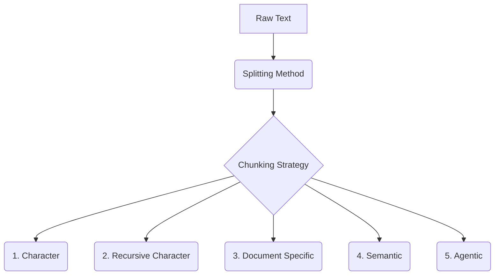

# The 5 Levels of Text Splitting for Retrieval

_Overview Diagram_

### The Theory of Text Splitting

Text splitting, or **chunking**, is the process of breaking down large documents into smaller, contextually relevant pieces. This is a critical step in building effective Retrieval-Augmented Generation (RAG) systems for several reasons:

- **Context Limits:** Language models have a finite context window (the maximum number of tokens they can process at once). Chunking ensures the information fed to the model fits within this limit.
- **Signal-to-Noise Ratio:** By retrieving only the most relevant chunks, you reduce the amount of irrelevant information (noise) sent to the LLM, which helps it generate more accurate and focused answers.
- **Performance & Cost:** Processing smaller chunks is faster and cheaper than feeding entire documents to an LLM.

The optimal chunking strategy depends heavily on the structure of your documents and the specific use case.

### The Five Levels of Text Splitting

#### 1. Character Splitting

This is the simplest and most naive approach. The text is split into chunks of a fixed character count.

- **Method:** Divide text every _N_ characters.
- **Drawback:** It often cuts words and sentences in half, destroying semantic context and making the chunks less meaningful. **This method is generally not recommended.**

#### 2. Recursive Character Splitting

This is a much smarter approach and a common default in frameworks like LangChain. It attempts to split text along a prioritized list of separators.

- **Method:** It tries to split on double newlines (`\n\n`) first (to keep paragraphs together), then single newlines (`\n`), then spaces (` `), and so on. This respects the natural structure of the text.
- **Benefit:** Creates more logically coherent chunks that are often aligned with paragraphs or sections.

#### 3. Document-Specific Splitting

This method tailors the splitting logic to the specific format of the document.

- **Method:** It uses separators that are specific to a file type. For example:
  - **Markdown:** Splits based on headers (`#`, `##`), code blocks, and other Markdown syntax.
  - **Python/JavaScript:** Splits based on classes or functions to keep logical code blocks together.
  - **PDFs:** Can consider layouts, tables, and multi-modal content.
- **Benefit:** Preserves the structural and semantic integrity of the source document.

#### 4. Semantic Splitting

This is a more advanced, context-aware method that uses embeddings to find split points.

- **Method:** The text is converted into vector embeddings. The algorithm then looks for points where the semantic meaning changes significantly (i.e., where the distance between sentence embeddings exceeds a certain threshold).
- **Benefit:** Creates chunks that are semantically consistent, grouping related ideas together even if they aren't separated by traditional formatting.

#### 5. Agentic Splitting

This is an experimental and highly advanced approach where an AI agent makes dynamic decisions about how to chunk the text.

- **Method:** An LLM-powered agent processes the document sequentially. For each new sentence or proposition, it decides whether it belongs to the current chunk or if it should start a new one based on semantic relevance.
- **Benefit:** Potentially the most contextually accurate form of chunking, but it is complex and computationally expensive.

### Bonus Level: Alternative Representations

Beyond just splitting text, you can index alternative representations of your data to improve retrieval:

- **Summaries:** Generate a summary for each chunk and embed the summary instead of (or in addition to) the raw text. This creates a higher semantic density.
- **Hypothetical Questions:** For each chunk, use an LLM to generate questions that the chunk could answer. Indexing these questions can improve retrieval for conversational chatbots.
- **Parent Document Retriever:** Store smaller chunks for retrieval but return the larger "parent" chunk (e.g., the full paragraph or section) to the LLM to provide more context.
- **Graph-Based Chunking:** Extract entities and their relationships from the text and store them in a knowledge graph. This allows for more complex, multi-hop queries.

### Reference

[The 5 Levels Of Text Splitting For Retrieval](https://www.youtube.com/watch?v=8OJC21T2SL4) by [Greg Kamradt](https://www.youtube.com/@GregKamradt)
