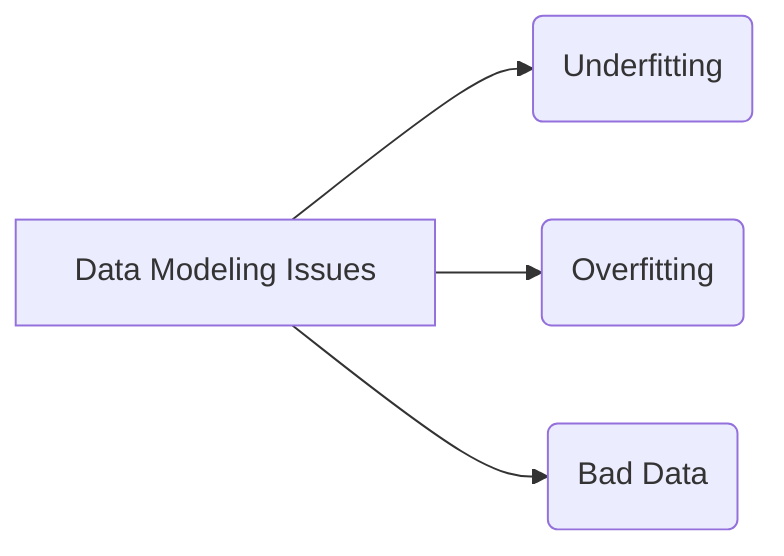

# Data Model Forecasting Pitfalls

_Overview Diagram_

### Underfitting

- Occurs when a data model is unable to accurately capture the relationship between input and output variables.
- Typically, occurs when a model is too simple and cannot establish the dominant trend within the data.
- An underfit model has high bias and low variance.
- Easy to spot, showing up even when modeling the training data set.
- **To Fix**:
  - Decrease regularization.
  - Increase training data.
  - Incorporate feature selection.

### Overfitting

- Occurs when a statistical model fits exactly against its training data.
- When this happens, the model cannot perform accurately against unseen data.
- Overfit models have a low error rate but very high variance.
- Overfitting isn’t always so easy to initially detect.
- Can be caused by addressing underfitting a little too aggressively.
- **To Fix:**
  - Use more data augmentation.
  - Employ Ensemble Methods.
  - Implement early stopping.

### Bad Data

- Data that is incorrect, irrelevant, or incomplete.
- Can lead to higher error rates and biased decision-making.
- **To Avoid**:
  - Ensure data is accurate and complete, by performing cross-checking against other data sources.
  - Remove outliers.
  - Ensure the data is timely, not outdated.

### Reference

[Overfitting, Underfitting, and Bad Data Are Ruining Your Predictive Models](https://www.youtube.com/watch?v=0RT2Q0qwXSA) by [IBM Technology](https://www.youtube.com/@IBMTechnology)
