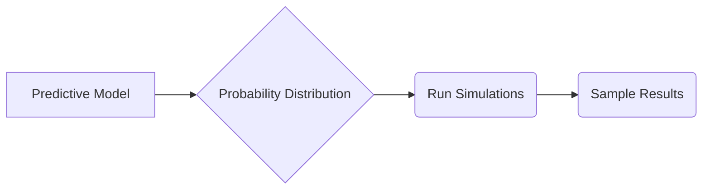

# Monte Carlo Simulation

_Overview Diagram_

### Introduction

- A Monte Carlo simulation is a mathematical technique used to estimate the possible outcomes of an uncertain event.
- It models the probability of outcomes that cannot be easily predicted due to the influence of random variables.
- The method uses "Random Sampling" to generate a multitude of possible outcomes and then calculates an average result to approximate the real-world probability.

### Example: Rolling Dice

To calculate the probability of rolling a "7" with two dice:

- **Brute Force Method:** Roll two dice thousands of times (e.g., 36,000) to gather a large sample and observe the frequency of rolling a 7.
- **Monte Carlo Method:** Instead of performing physical rolls, randomly sample from the 36 possible outcomes of a two-dice roll. By running a sufficient number of simulations, you can approximate the probability without exhaustive physical trials.

### Who Uses Monte Carlo Simulations?

This technique is widely used across various fields:

- **Finance:** Portfolio management, investment planning, risk analysis, and option pricing.
- **Operations:** Planning for spare parts and capacity.
- **Science:** Medicine and astrophysics.
- **Recreation:** Determining the optimal starting word for games like Wordle.

### Steps to Run a Monte Carlo Simulation

1.  **Set Up the Predictive Model:**
    - Identify the **dependent variable** you want to predict (the outcome).
    - Identify the **independent variables** (the input risks or drivers) that will influence the outcome.

2.  **Specify the Probability Distribution:**
    - Define the probability distribution for each independent variable.
    - This can be based on historical data or subjective analysis.
    - Define the range of likely values and assign probability weights for each.

3.  **Run the Simulations Repeatedly:**
    - Generate random values for the independent variables based on their specified probability distributions.
    - Repeat this process until you have gathered enough results to form a representative sample of the nearly infinite number of possible combinations.
    - Analyze the range of variations within the generated samples.

**Note:** The accuracy of the estimation improves with the number of samples. The more simulations you run, the more reliable your results will be.

### Reference

[What is Monte Carlo Simulation?](https://www.youtube.com/watch?v=7TqhmX92P6U) by [IBM Technology](https://www.youtube.com/@IBMTechnology)
