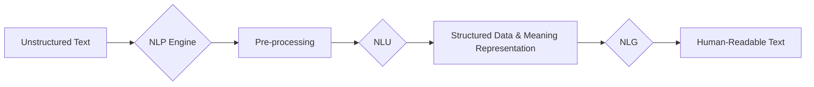

# Natural Language Processing (NLP)

_Overview Diagram_



### Introduction

- Natural Language Processing (NLP) is a field of Artificial Intelligence that gives computers the ability to understand, interpret, and generate human language, both text and speech.

### Unstructured vs. Structured Text

- **Unstructured Text:** This is the free-form language humans use every day in conversation, emails, or documents. It does not have a predefined format.
  - Example: “Add eggs and milk to my shopping list.”

- **Structured Text:** This is data that is organized in a predefined format, making it easily understandable for machines.
  - Example (XML):
    ```xml
    <shoppingList>
      <item>eggs</item>
      <item>milk</item>
    </shoppingList>
    ```

### NLU and NLG: The Two Sides of NLP

NLP is broadly composed of two main components:

- **NLU (Natural Language Understanding):** The process of converting unstructured human language into a structured, machine-readable format. This involves interpreting the intent and meaning behind the words.
- **NLG (Natural Language Generation):** The process of converting structured data back into natural, human-readable language.

### Common NLP Use Cases

- **Machine Translation:** Translating text or speech from one language to another while preserving context and meaning.
- **Virtual Assistants/Chatbots:** Deriving user intent from unstructured commands to perform tasks or carry on a conversation.
- **Sentiment Analysis:** Determining the emotional tone (positive, negative, neutral, sarcastic) of a piece of text, often used for analyzing customer reviews or social media posts.
- **Spam Detection:** Identifying unwanted emails by analyzing characteristics like overused keywords, poor grammar, and suspicious links.

### The NLP Process: Key Steps

NLP is not a single algorithm but a pipeline of several processes working together. Common steps include:

1.  **Tokenization:** Breaking down a sentence or a string of text into individual words or units, known as "tokens."
2.  **Stemming:** A crude method of reducing words to their root form by chopping off prefixes or suffixes (e.g., "running" becomes "run").
3.  **Lemmatization:** A more sophisticated method that uses a dictionary to find the true root form (lemma) of a word, considering its context (e.g., "better" becomes "good").
4.  **NER (Named Entity Recognition):** Identifying and classifying named entities in text, such as people, organizations, locations, dates, and other specific categories.

### Reference

[What is NLP (Natural Language Processing)?](https://www.youtube.com/watch?v=fLvJ8VdHLA0) by [IBM Technology](https://www.youtube.com/@IBMTechnology)
