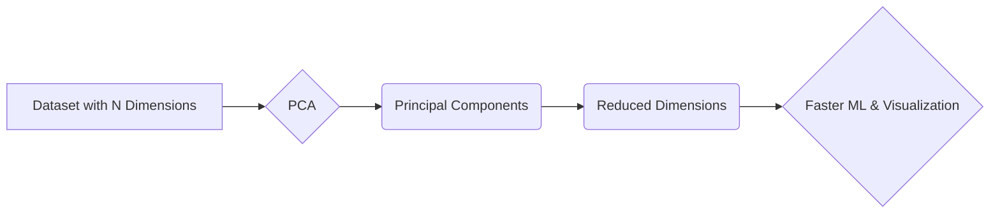

# Principal Component Analysis (PCA)

_Overview Diagram_

### What is Principal Component Analysis (PCA)?

Principal Component Analysis (PCA) is a popular dimensionality reduction technique used to simplify complex datasets. It works by identifying the most important dimensions, called **Principal Components**, and transforming the data into a new, smaller set of uncorrelated variables while retaining most of the original information.

This process reduces the complexity of large datasets, which can lead to faster training times for machine learning algorithms and make data visualization easier.

### The “Curse of Dimensionality”

In data science, "dimensions" are the features or variables within a dataset (e.g., in a loan application dataset, dimensions could be `Loan Amount`, `Credit Score`, `Annual Income`, etc.).

The **“Curse of Dimensionality”** refers to the negative impact that a high number of dimensions can have on a model's performance. As the number of dimensions increases, the data becomes more sparse, and the model is more likely to **overfit**. Overfitting occurs when a model learns the training data too well, including its noise, and fails to generalize to new, unseen data.

PCA helps mitigate this curse by reducing the number of dimensions to only the most significant ones.

### What are Principal Components?

Principal Components are the new, uncorrelated variables created by PCA. They are ordered by the amount of variance they explain in the original data.

- **PC1 (First Principal Component):** The dimension that captures the highest amount of variance in the data.
- **PC2 (Second Principal Component):** The dimension that captures the next highest amount of variance, and is uncorrelated with (orthogonal to) PC1.

By using just the first few principal components (like PC1 and PC2), you can often represent a large portion of the information from the original high-dimensional dataset in a much simpler, lower-dimensional space.

### Use Cases

- **Faster Machine Learning:** Training models on fewer dimensions is computationally cheaper.
- **Simpler Data Visualization:** Reducing data to 2 or 3 dimensions allows for easy plotting and visualization.
- **Image Compression:** Reducing the dimensionality of image data while retaining key features.
- **Risk Analysis:** Identifying the most important factors in applications like loan risk assessment.
- **Medical Diagnostics:** Finding key patterns in complex medical data to help diagnose diseases.

### Reference

[Principal Component Analysis (PCA) Explained: Simplify Complex Data for Machine Learning](https://www.youtube.com/watch?v=ZgyY3JuGQY8) by [IBM Technology](https://www.youtube.com/@IBMTechnology)
