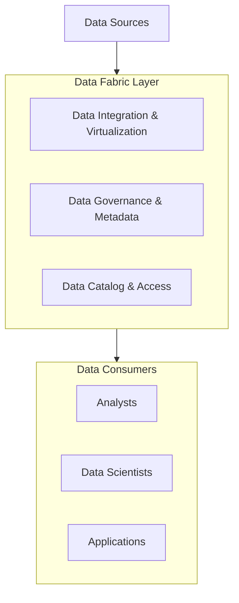

# Data Fabric Explained

_Overview Diagram_

### The Modern Data Challenge

Companies today collect vast amounts of data from a wide variety of sources, including on-premises databases, cloud data warehouses, data lakes, and SaaS applications. This distributed data landscape creates significant challenges:

- How can we access all this data efficiently?
- How can we govern and manage the data to ensure security and compliance?
- What is the right architecture to handle this complexity?

### Methodologies for Managing Data

- **Data Fabric:** An architectural approach designed to break down data silos and get data into the hands of users, regardless of where the data lives. It focuses on connecting to data sources in a governed manner through a combination of virtualization and integration.
- **Data Mesh:** An organizational and architectural approach that decentralizes data ownership. It treats data as a product, with different business domains responsible for their own data.

### Core Data Infrastructure Tools

- **Cloud Enterprise Data Warehouse (EDW):** A central repository for clean, structured, and organized business data.
- **Data Lakes:** A repository for storing large volumes of raw, unstructured, or semi-structured data for later processing and analysis.
- **Data Lakehouses:** A hybrid architecture that combines the structured data management features of a data warehouse with the flexibility and low-cost storage of a data lake.

### The Focus Areas of a Data Fabric

A data fabric is not a single tool but a unified layer that provides services across three main focus areas:

**1. Data Access and Integration**

- A data fabric provides a unified view of data from all sources.
- **Data Virtualization:** It can query data where it resides without needing to move it.
- **Data Integration (ETL):** It also supports traditional Extract, Transform, Load (ETL) processes to move data into a central repository when needed.

**2. Data Lifecycle Management**
A data fabric automates the management of the entire data lifecycle.

- **Governance and Privacy:** It enforces policies to ensure that the right people have access to the right data. This is often automated using **active metadata**, which allows policies to be applied dynamically based on data classifications.
- **Compliance:** It helps organizations implement and manage solutions to comply with ever-increasing data regulations (like GDPR or CCPA).

**3. Data Discovery and Exposure**
A data fabric makes it easy for users to find and use the data they need.

- **Enterprise Catalog:** It integrates with the company's data catalog, allowing business analysts, data scientists, and application developers to discover available datasets.
- **Example:** In a hotel company, a data fabric could provide a unified view of customer data from booking systems, loyalty programs, and on-site services. A data scientist could then use this unified data to build an application that provides personalized recommendations and a seamless customer experience.

### Reference

[Data Fabric Explained](https://www.youtube.com/watch?v=0Zzn4eVbqfk) by [IBM Technology](https://www.youtube.com/@IBMTechnology)
