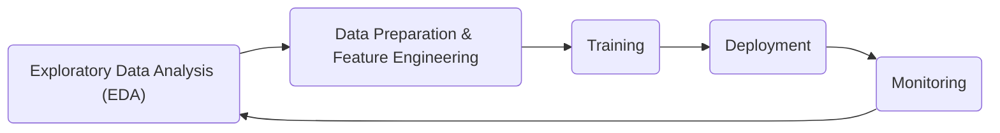

# MLOps: Streamlining the Machine Learning Lifecycle

_Overview Diagram_

### Introduction

MLOps (Machine Learning Operations) is a set of practices that applies DevOps principles to the machine learning workflow. The goal is to automate and streamline the end-to-end process of building, training, deploying, and monitoring machine learning models.

### The Manual Machine Learning Workflow

A typical, manual ML workflow consists of several distinct stages:

1.  **Exploratory Data Analysis (EDA):** Understanding the data, identifying patterns, and forming hypotheses.
2.  **Data Preparation and Feature Engineering:** Cleaning the data, handling missing values, and creating features that the model can use for training.
3.  **Training:** Selecting an appropriate algorithm, training the model on the prepared data, and optimizing its hyperparameters for the best performance.
4.  **Deployment:** Integrating the trained model into a production environment, often by wrapping it in an API so that other applications can use it.
5.  **Monitoring:** Continuously tracking the model's performance in production to detect issues like model drift or data degradation. The business needs to determine if the model's accuracy is still sufficient.
6.  **Iteration:** Using insights from monitoring and new data to retrain and improve the model, starting the cycle over again.

### Applying Continuous Integration and Continuous Deployment (CI/CD)

MLOps automates this manual workflow by applying CI/CD principles:

- **Continuous Integration (CI):** Automatically building and testing code changes. In MLOps, this extends to automatically testing data schemas, models, and training pipelines.
- **Continuous Deployment (CD):** Automatically deploying updates to production. For MLOps, this means automatically deploying new model versions or retraining pipelines when triggered by new data or code updates.

### Benefits of MLOps

- **Efficiency and Speed:** Reduces manual steps, which streamlines the entire process from experiment to production and ensures consistency.
- **Scalability:** Enables teams to manage hundreds or thousands of models reliably.
- **Improved Collaboration:** Provides a common framework for data scientists, ML engineers, and operations teams to work together.
- **Focus on Innovation:** Frees up data scientists to focus on what they do best—building and improving models—rather than on manual deployment and maintenance tasks.

### Reference

[What is MLOps?](https://www.youtube.com/watch?v=OejCJL2EC3k) by [IBM Technology](https://www.youtube.com/@IBMTechnology)
