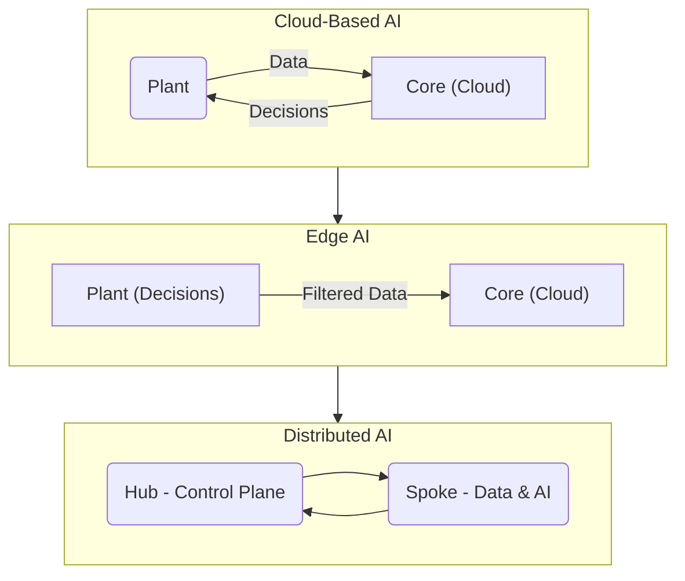

# AI Deployment Paradigms: Cloud, Edge, and Distributed

_Overview Diagram_

### Introduction

The architecture for deploying AI models has evolved to handle challenges related to data volume, latency, and resource constraints. The primary paradigms are Cloud-based AI, Edge AI, and Distributed AI.

### Cloud-Based AI

This is the traditional, centralized approach where all AI processing happens in a central location.

- **How it Works:**
  1.  Data from operational sites (e.g., a factory, a retail store) is sent to a central core, which can be a public cloud or an enterprise data center.
  2.  Both the AI model training and inference (decision-making) occur at this central core.
  3.  The decisions or results are then sent back to the operational site to drive automation.
- **Challenges:**
  - **Data Volume:** Sending massive amounts of raw data to the cloud can be slow and expensive.
  - **Latency:** The round-trip time for data to travel to the cloud and back can be too long for real-time applications.
  - **Data Sensitivity & Connectivity:** Regulations or poor network connectivity may prevent data from leaving the local site.

### Edge AI

Edge AI moves the decision-making process closer to where the data is generated, addressing the latency and connectivity issues of the cloud-based model.

- **How it Works:**
  1.  The AI model is deployed directly at the operational site (the "edge").
  2.  Inference and real-time decision-making happen locally on the edge device.
  3.  Only essential or summarized data is sent back to the central core for further analysis, model retraining, or long-term storage.
- **Benefits:**
  - Low latency for real-time automation.
  - Reduced data transfer costs.
  - Operational continuity even with intermittent network connectivity.

### Distributed AI

Distributed AI is an advanced paradigm that orchestrates data and AI applications across multiple distributed environments (e.g., multiple edge locations and a central cloud hub). It provides a unified way to manage a fleet of AI deployments.

- **Key Components:**
  - **Hub:** The central control plane, typically in a public cloud or data center. It is responsible for managing policies, deploying models, and orchestrating the entire system.
  - **Spoke:** A distributed location where data resides and AI models are executed (e.g., a factory, a remote server). Each spoke is a node in the distributed network.

- **Core Capabilities of Distributed AI:**
  - **Intelligent Data Collection:** Policies determine what data is essential to collect, what to process locally at the spoke, and what to send back to the hub. This addresses the challenge of **data gravity** (the difficulty of moving large datasets).
  - **Adaptation and Monitoring:** The system continually monitors the performance of AI models at the spokes and can adapt to changes in the local environment. This helps manage **heterogeneity** across different sites.
  - **Optimization:** Optimizes data pipelines and resource usage across the entire network, addressing **resource constraints** at the edge.
  - **Automation:** Uses a policy-based approach to automate decisions about data replication, model updates, and data lifecycle management (e.g., when to purge old data).

By combining a central control hub with distributed spokes, Distributed AI offers a scalable and manageable way to deploy sophisticated AI applications across a wide geographical or logical area.

### Reference

[Edge AI vs. Distributed AI](https://www.youtube.com/watch?v=jevuDDjFEsM) by [IBM Technology](https://www.youtube.com/@IBMTechnology)
