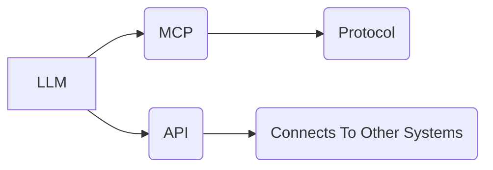

# MCP vs. API: A Comparison for AI Agent Integration

_Overview Diagram_

### Introduction

LLMs often need to interact with external data sources and services to perform tasks. While this has traditionally been handled with custom API integrations, a new open standard called the **Model Context Protocol (MCP)** was introduced by Anthropic to standardize these interactions.

- **API (Application Programming Interface):** A general-purpose interface that allows one system to access the functionality or data of another. It requires the client to have prior knowledge of the specific endpoints and data structures.
- **MCP (Model Context Protocol):** A specialized protocol purpose-built for AI applications. It standardizes how an agent can discover and use external tools and resources at runtime. Think of it as a "USB-C port" for AI applications, where any compliant tool can be plugged in.

### Core Differences

| Feature              | Traditional API                                            | Model Context Protocol (MCP)                                                                   |
| -------------------- | ---------------------------------------------------------- | ---------------------------------------------------------------------------------------------- |
| **Purpose**          | General-purpose system integration.                        | Purpose-built for AI agents and LLMs.                                                          |
| **Discovery**        | Static. Client must be pre-programmed for each API.        | Dynamic. Agents can query a server at runtime to discover its capabilities (tools, resources). |
| **Interface**        | Custom for each service (REST, GraphQL, etc.).             | Standardized protocol (JSON-RPC 2.0). All servers and clients speak the same language.         |
| **Flexibility**      | Low. Adding a new tool often requires client code changes. | High. Agents can use new tools from an MCP server without being reprogrammed.                  |
| **Primary Use Case** | Connecting any two software systems.                       | Providing contextual data and enabling tool use for AI agents.                                 |

### MCP Architecture

The MCP architecture is designed for dynamic interaction:

1.  **MCP Host:** The main application (the AI agent) runs one or more **MCP Clients**.
2.  **MCP Server:** An external service that exposes tools and resources.
3.  **Communication:** The client establishes a session with the server using **JSON-RPC 2.0** (over `stdio` for local processes or HTTP/SSE for networked ones).
4.  **Capabilities:** The client can ask the server, "What can you do?" The server responds with a list of its available tools, prompts, and resources.

### How MCP Enhances AI Agents

MCP directly addresses two core needs of modern AI applications:

1.  **Providing Contextual Data:** It allows an agent to dynamically pull in relevant information (e.g., from a database or a file) to inform the LLM. It helps manage the "long-term dependency" problem by fetching only what's needed for the current context.
2.  **Enabling Tool Use:** MCP provides a standard way for an agent to use external tools like web search, calculators, or external service calls. The agent can discover these tools and learn how to use them on the fly.

### Similarities

- Both use a client-server model.
- Both provide a layer of abstraction to simplify integration.

### Conclusion

While APIs are the universal standard for general software integration, **MCP is a specialized evolution designed for the dynamic, unpredictable nature of AI agents.** Its key advantages are **dynamic self-discovery** and a **standardized interface**, which allow agents to be more flexible, adaptable, and easier to extend with new capabilities without requiring constant reprogramming.

### References

[MCP vs API: Simplifying AI Agent Integration with External Data](https://www.youtube.com/watch?v=7j1t3UZA1TY) by [IBM Technology](https://www.youtube.com/@IBMTechnology)
