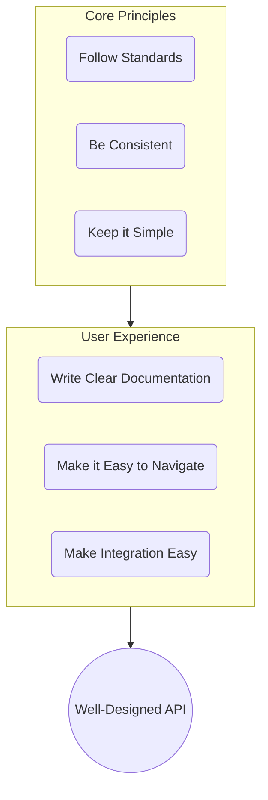

# 6 Tips for Designing a Great REST API

_Overview Diagram_

### 1. Follow the Standards

Using established standards makes your API predictable and easier for developers to adopt.

- **API Description:** Use the **OpenAPI Specification** (formerly Swagger) to formally describe your HTTP APIs. This allows you to generate documentation, client libraries, and interactive API consoles automatically.
- **Authentication:** Adhere to standards like **OAuth** or use simple API keys. This is a well-understood pattern that developers are familiar with.
- **RESTful Architecture:** Follow the principles of REST (REpresentational State Transfer). This includes using standard HTTP verbs and consistent resource naming.
  - **Nouns for Resources:** Endpoints should represent nouns (e.g., `/customers`, `/orders`).
  - **Plural for Collections:** Use plural nouns for endpoints that represent a collection of resources (e.g., `/customers` to get all customers, not `/customer`).
  - **Standard HTTP Verbs:**
    - `GET`: Retrieve a resource.
    - `POST`: Create a new resource.
    - `PUT`/`PATCH`: Update a resource (PUT for full replacement, PATCH for partial updates).
    - `DELETE`: Remove a resource.

### 2. Be Consistent

Consistency across your API is crucial for a good developer experience. Inconsistent naming and structures force users to constantly refer to the documentation.

- **Naming Conventions:** Use the same naming scheme everywhere. For example, if a user ID is `payer_id` in one endpoint, it shouldn't be `recipient_id` in another if it represents the same concept.
- **Data Formats:** Use the same format for common data types like dates, times, and query parameters.
- **Pagination:** Implement a consistent pagination scheme (e.g., using `limit` and `offset` or cursor-based pagination) for all collection endpoints.

### 3. Keep Things Simple for the End User

An API should be intuitive and require the user to do as little work as possible.

- **Sensible Defaults:** Provide default values for parameters wherever possible. For example, if a user is searching for transactions within a time range, the `end_date` could default to the current time, preventing the user from having to supply it for common queries.
- **Clear Date/Time Formats:** Avoid overly complex or obscure date formats. Standard formats like ISO 8601 are generally best, but be clear about what you expect.

### 4. Write Clear Documentation

Good documentation is as important as the API itself. Without it, even the best-designed API is difficult to use.

- **Provide Code Examples:** Include clear, copy-pasteable examples for common requests (e.g., `cURL`) and popular programming languages (Python, JavaScript, etc.).
- **Explain Every Field:** For each resource object, document what every field means. Don't assume the user understands your internal business logic from a field name alone.
- **Structure by Resource:** Organize your documentation around the resources your API exposes (e.g., a "Customer Object" page that explains all attributes of a customer).

### 5. Make Your API Easy to Navigate

A well-designed API allows users to discover related resources easily. This concept is sometimes referred to as HATEOAS (Hypermedia as the Engine of Application State).

- **Link Related Resources:** A response for one resource should contain identifiers or direct links to related resources.
  - An `order` object should contain the `customer_id`.
  - A `payment_intent` object should reference the associated `customer` and the `latest_charge`.
  - A `charge` object should link back to its corresponding `invoice` or `payment_intent`.
- **Benefits:** This creates a navigable graph of resources, allowing developers to move from one object to another without having to construct complex queries or guess endpoint paths.

### 6. Make Integration Easy with Custom Data

Modern applications often need to integrate data from many different third-party systems. A great API makes this easy by allowing users to store their own metadata.

- **Why it's needed:** A developer might need to link a customer from your API to a corresponding record in their CRM, accounting software, and email marketing platform.
- **The Problem:** Without a way to store external IDs, the developer has to maintain these mappings in their own separate database, which is complex and brittle.
- **The Solution: Provide a `metadata` Field**
  - Include a `metadata` object (a key-value dictionary) on your primary resources.
  - This allows users to attach their own identifiers and custom data directly to your objects (e.g., storing a `moneybird_id` on a Stripe `customer` object).
  - **Implementation Note:** When updating metadata, perform a _merge_ operation, not a full replacement. This allows users to add or update individual keys without overwriting existing metadata.

### Reference

[6 Easy Tips to Design an AWESOME REST API](https://www.youtube.com/watch?v=SjUQLryotAk) by [ArjanCodes](https://www.youtube.com/@ArjanCodes)
