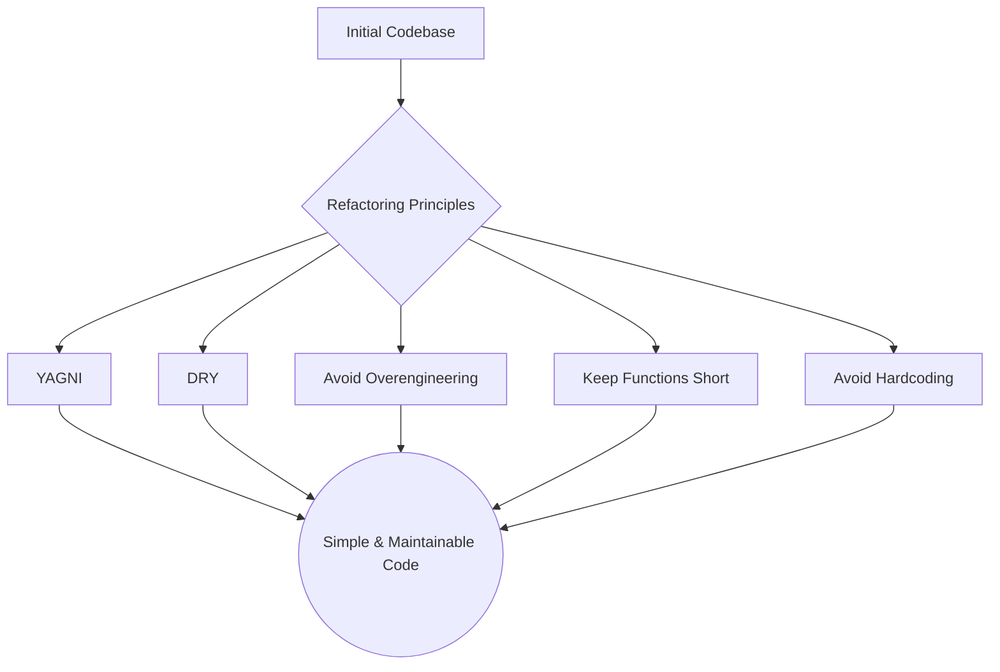

# 10 Tips for Simpler, More Maintainable Code

_Overview Diagram_

### Introduction

Writing code that is simple, maintainable, and easy to work with is a critical skill for any developer. This guide presents key principles and techniques to refactor a complex system into a cleaner, more robust one.

### 1. YAGNI (You Ain't Gonna Need It)

Avoid building features "just in case." Writing code for functionality you don't currently need adds complexity, increases the maintenance burden, and requires writing unnecessary tests.

- **Action:** If a class or feature is defined but not used in your main application logic, remove it. You can always add it back later if the requirement becomes real. This immediately reduces the amount of code you have to manage.

### 2. DRY (Don't Repeat Yourself)

Code duplication is a major source of bugs and maintenance headaches. If you find yourself copying and pasting logic, it's a sign that you need to create a more generic abstraction.

- **Example:** Having multiple methods like `find_managers()`, `find_vice_presidents()`, and `find_support_staff()` that only differ by a single string value is repetitive.
- **Action:** Create a single, more generic method, such as `find_by_role(role: str)`, to eliminate the duplication. This ensures that any future bug fixes or improvements only need to be made in one place.

### 3. Avoid Overengineering

Don't introduce complex design patterns or layers of abstraction for simple problems. A simple problem should have a simple solution.

- **Example:** Using an Abstract Base Class, multiple subclasses, and a Factory pattern just to send an email or an SMS is overkill.
- **Action:** Replace the entire complex class structure with simple, standalone functions like `send_email()` and `send_sms()`. Start with functions and only introduce classes when you genuinely need to group state and behavior.

### 4. Organize Yourself

Simple software is easier to build with simple organizational processes. Use project management tools (like Kanban boards) to keep your work organized, your team aligned, and your development process efficient.

### 5. Keep Functions Short (Single Responsibility)

Each function should have a single, clear responsibility. If a function's name contains "and" or "or," it's a red flag that it's doing too much.

- **Example:** A method called `take_a_holiday(payout: bool)` that handles both taking a single day off and paying out multiple holidays is confusing.
- **Action:** Split it into two distinct methods with clear names and responsibilities: `take_a_single_holiday()` and `payout_holidays()`.

### 6. Avoid Hardcoded Values

Magic numbers and strings scattered throughout your code make it difficult to read and update.

- **Action:** Extract hardcoded values into named constants defined at the top of your module (e.g., `PAYOUT_HOLIDAY_DAYS = 5`). This makes the code self-documenting and provides a single place to make changes.

### 7. Use Meaningful Names

Use clear, descriptive names for variables and functions to make the code self-explanatory.

- **Example:** A variable named `amount` is vague. A name like `hours_per_month` is much clearer.
- **Action:** Choose names that accurately reflect the purpose and unit of the data, which reduces the need for comments.

### 8. Document Your Thought Process, Not What the Code Does

Good code explains _what_ it is doing. Comments should explain _why_ it is being done.

- **Bad Comment:** `# check whether vacation_days is less than 1` (This just repeats the code).
- **Good Comment:** `# check whether the employee still has holidays left` (This explains the business logic).

### 9. Don't Overcomplicate Your Module Structure

A flat module structure is often better than a deeply nested one. Avoid creating unnecessary folders and layers of abstraction.

- **Action:** Start with a simple file structure. Only introduce sub-packages and folders when the complexity of the project genuinely requires it. This keeps imports simple and the codebase easy to navigate.

### 10. Write Tests for Critical Code

Writing tests forces you to design modular and clean code. It is an essential practice for ensuring your code works as expected.

- **Action:** Maintain a parallel `tests/` directory that mirrors your source code structure. Writing tests makes your code more robust and easier to refactor with confidence.

### Bonus: Spend 10% of Your Time on Refactoring

Make refactoring a continuous and frequent habit.

- **Action:** Dedicate about 10% of your development time to small, incremental improvements. This prevents technical debt from building up, helps you better understand the problem domain, and leads to a much cleaner codebase over time.

### Reference

[10 Tips to Keep Your Software Simple](https://www.youtube.com/watch?v=0U-RwnWaFIM&t) by [ArjanCodes](https://www.youtube.com/@ArjanCodes)
