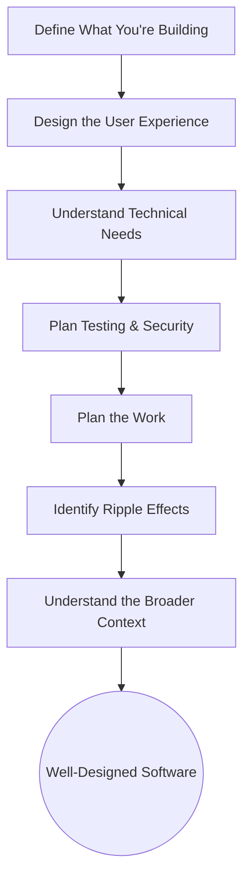

# The 7-Step Software Design Guide

_Overview Diagram_

### Introduction

Designing software is a complex task that requires structured thinking to avoid creating "spaghetti code." This 7-step framework provides a consistent process for designing new features or entire applications, ensuring that key aspects are considered and helping to train your design thinking skills.

### 1. Define What You're Building

The first step is to achieve a clear understanding of the problem you are solving. This is the most crucial phase of design.

- **What is the software application or feature?**
- **Who is it intended for?** (Target audience)
- **What problem does the software solve?**
- **How is it going to work?** (High-level functionality)
- **What are the main concepts and their relationships?** (Domain model)

**Key Concepts:**

- **Domain-Driven Design (DDD):** Focus on modeling the core domain. It's best to design and implement in parallel, creating a crude prototype early. This allows you to get a feel for technical limitations and refine the design based on new insights.
- **Distill the Model:** Don't hesitate to remove unnecessary complexity. Simplifying the design lets you focus on the core requirements. The best refactoring is often removing code.
- **Zoom Out, Zoom In:** Start by thinking broadly about the software and its scope ("zoom out"). Then, focus on the specifics: what to build first, what can be delayed, and how to tackle complexity efficiently ("zoom in").
- **Minimum Viable Product (MVP):** Do the minimum work necessary to build something useful that can be tested with users and form the basis of a business.

### 2. Design the User Experience (UX)

Focus on how the user will interact with the software. Always remember you are building for someone else, not for yourself.

- **What are the main user stories (happy flows + alternative flows)?**
- **What is the impact on the existing UI/navigation?**
- **Provide UI mockups or wireframes to clarify flows.**

**Key Concepts:**

- **User-Centric Design:** The design must make sense to the user. Sometimes a generic, powerful solution is not what users need. Keep it simple and validate user needs before building.
- **Cost of UI Changes:** Building and changing user interfaces is time-consuming. It involves not just coding but also updating documentation, communicating with users, and fixing potential bugs.

### 3. Understand the Technical Needs

Translate the conceptual design into a concrete technical plan.

- **What database changes are needed (new tables, fields)?**
- **Are specific algorithms or libraries required?**
- **What will the overall design be (classes, design patterns)?**
- **What third-party software is needed?**

**Key Concepts:**

- **Diagram Your Design:** Use tools like UML or Mermaid (text-based) to draw the main classes and their relationships.
- **Principles for Maintainable Code:**
  - **Use functions over classes:** Functional code is often simpler. Introduce a class only when you have many related arguments or need an object representation for data.
  - **Keep things small and simple:** This applies to modules, functions, and classes. Smaller components are easier to read and test.
  - **Separate creation from usage:** Pass dependencies into functions (Dependency Injection) rather than creating them inside. This greatly improves testability.
  - **Use abstraction:** Depend on interfaces (like Python's ABCs or Protocols) rather than concrete implementations to reduce coupling.

### 4. Implement Testing and Security Measures

Integrate testing and security into the design process from the beginning.

- **Are there specific code coverage goals?**
- **What kinds of tests are needed (unit, regression, end-to-end)?**
- **What are the potential side-effects of a new feature?**
- **What security checks are necessary before shipping?**

**Key Concepts:**

- **Develop a Tester's Mindset:** Designing code that is easy to test inherently leads to better design. It forces you to handle edge cases by default and create clear interfaces.
- **Leverage the Type System:** Use constructs like Enums instead of raw strings for function arguments. This allows the type checker to catch invalid inputs at compile time, reducing the need for manual edge-case handling and testing.
- **Don't Get Attached to Code:** Assume you will throw away every line of code you write. Focus on getting a basic version done to evaluate with users, rather than aiming for 100% test coverage on the first iteration.

### 5. Plan the Work

Break down the implementation into manageable steps and estimate the effort.

- **How much time will development take?**
- **What are the steps, milestones, and their order?**
- **Are there any migration scripts to write?**
- **What are the main risk factors and alternative routes?**
- **What is the "Definition of Done"? (Required vs. optional parts)**

**Key Concepts:**

- **Identify Risks Early:** Estimating is difficult, but it helps to identify the riskiest parts of the design first. For example, a complex third-party integration is often a bigger risk than a simple UI change. The more risk factors, the more buffer time you need for unexpected issues.

### 6. Identify Ripple Effects

Think beyond the code and consider the broader impact of your changes on the entire product ecosystem.

- **What documentation needs to be updated?**
- **How will changes be communicated to existing users?**
- **Do other external systems need to be updated (e.g., payment provider, sales system, email marketing)?**

**Key Concepts:**

- **Software is More Than Code:** Building the feature is just one part of the process. Releasing it, documenting it, and ensuring customers can use it successfully takes significant time. Considering these ripple effects early prevents last-minute surprises. This is a primary reason why large software companies often appear to move slowly.

### 7. Understand the Broader Context

Finally, place your design within the long-term vision for the software.

- **What are the limitations of the current design?**
- **What are possible extensions for the future?**
- **Are there other considerations like budget?**

**Key Concepts:**

- **"Moonshot" Ideas:** Include a few ambitious ideas for what the software could _also_ do. This encourages an open mindset that can lead to unexpected insights and epiphanies during development.
- **Document Limitations:** Knowing the weaknesses of your design provides an immediate starting point for future improvements and refactoring efforts.

### Reference

Software Design Guide by [ArjanCodes](https://www.youtube.com/@arjancodes)
