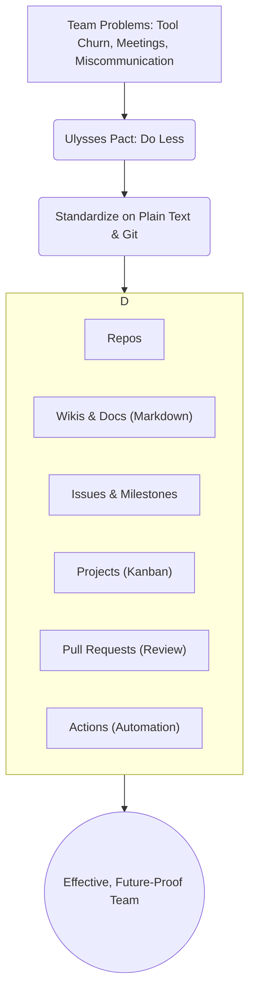

# Plain-Text Team: Using Git for Everything

_Overview Diagram_

### The Problem: Why Modern Teams are Inefficient

Modern digital and tech teams often suffer from a common set of problems:

- **Bad Software:** A constantly changing landscape of project management apps, documentation tools, and chat clients.
- **Process Churn:** Constant changes to workflows to accommodate new tools.
- **Excessive Meetings:** Endless meetings are required because verbal communication is impermanent and memory is unreliable, leading to misalignment.

This churn creates overhead, makes documentation legacy almost immediately, and discourages team members from writing things down because the tools are always changing.

### The Solution: A Ulysses Pact for Simplicity

To solve these problems, teams must have the discipline to do less. This is achieved by making a **Ulysses Pact**: a pre-commitment to a simple, stable set of tools to resist the temptation of new, shiny apps that solve the same problems in slightly different ways.

The pact is to **standardize all team collaboration on plain-text tools**, specifically **Git** and a Git host like **GitHub**.

### Why Git and Plain Text?

- **Future-Proofing:** Git and plain text (like Markdown) are universal, open standards. They are not going away. Committing to them means your team's knowledge and processes won't be trapped in a proprietary app that gets decommissioned (e.g., the "Killed by Google" graveyard).
- **Data Portability & Control:** Your data lives in plain-text files. It is not locked in a proprietary database. You can edit it with any tool, migrate it to any platform, and access it offline. This gives your team ultimate control.
- **Network Effects:** By standardizing on the most popular version control system, you benefit from a massive ecosystem of integrations, community support, and experienced users.

### Building Your Team on a Git Host

Git hosts like GitHub, GitLab, or Bitbucket provide a suite of tools built around Git repositories that can manage your entire team's workflow, not just code.

- **Repos:** The fundamental unit. Each logical project or sub-project gets its own repository.
- **Wikis & Markdown:** Each repo has a simple, linked wiki for documentation. **Markdown** is the lightweight text format used everywhere. It is human-readable as plain text and renders nicely as rich text, focusing on content over complex formatting.
- **Issues:** A simple but powerful task management system for capturing features, bug reports, or ideas. They support discussions, assignments, and tagging.
- **Milestones:** A way to group issues together with a deadline, representing a target or a release.
- **Projects:** Lightweight Kanban boards that act as an "information radiator," giving a high-level view of work in progress. This is the minimum viable board needed to run effective, short standups.
- **Pull Requests (PRs):** This is the core of asynchronous collaboration. A PR represents any proposed change to the files in a repo, providing a space for detailed discussion and review before the change is merged. This process applies to documentation and designs just as effectively as it does to code.
- **GitHub Actions:** A powerful automation engine that can be triggered by events in the repo. Actions can run tests, spell-check documents, build artifacts, or even run your entire company's operational workflows.

By adopting this plain-text-first approach, teams can eliminate tool churn, improve communication through clear documentation and asynchronous reviews, and build a stable, future-proof system for collaboration.

### Reference

[The Unreasonable Effectiveness Of Plain Text](https://www.youtube.com/watch?v=WgV6M1LyfNY&t) by [No Boilerplate](https://www.youtube.com/@noboilerplate)
