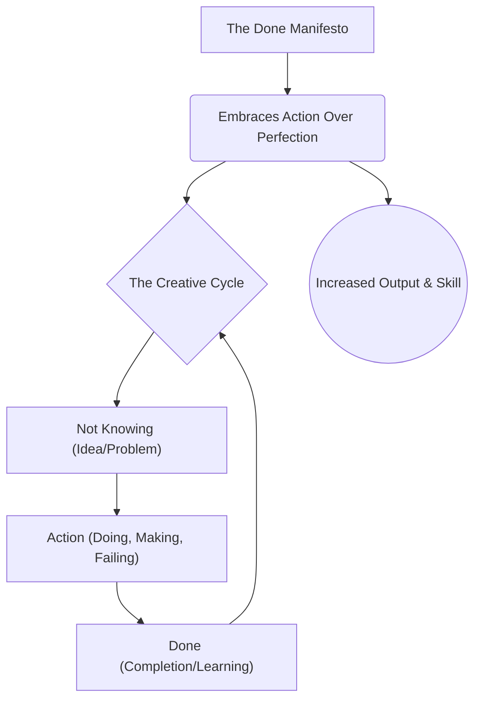

# The Done Manifesto

_Overview Diagram_

### Introduction

The Done Manifesto, created by Bre Pettis and Kio Stark, is a set of 13 principles designed to combat procrastination and the paralysis of perfectionism. It is a philosophy that prioritizes action and completion over endless planning and editing, fostering a productive and iterative creative process.

### The 13 Principles of Done

1.  **There are three states of being: Not Knowing, Action, and Completion.**
    - Every project moves through these phases. You begin with an idea (Not Knowing), you work on it (Action), and you finish it (Completion). This cycle is continuous; completing one project gives you the knowledge to begin the next.

2.  **Accept that everything is a draft. It helps to get it done.**
    - Perfection is unattainable. Viewing your work as a draft frees you from the pressure of getting it perfect the first time. The goal is to move forward, not to create a flawless masterpiece on the first attempt.

3.  **There is no editing stage.**
    - This principle models the real world, where actions have consequences. Once something is released, it cannot be perfectly edited or undone. Instead of endless tweaking, embrace the finality of your work and move on to creating the next version. Make a new one instead of obsessing over the old one.

4.  **Pretending you know what you're doing is almost the same as knowing what you are doing.**
    - This is the classic advice to "fake it 'til you make it." Confidence and competence are built through action. By acting as if you know what to do, you start the process of learning and eventually gain real skill.

5.  **Banish procrastination. If you wait more than a week to get an idea done, abandon it.**
    - Creativity is fleeting. This rule forces you to act on inspiration quickly. If an idea isn't compelling enough to start within a week, it clogs your creative pipeline. Let it go and make room for the next idea.

6.  **The point of being done is not to finish, but to get other things done.**
    - Completion is not the end goal; it is the catalyst for future work. Each finished project provides momentum, experience, and wisdom that makes starting the next project easier.

7.  **Once you're done, you can throw it away.**
    - The true value of creative work is in the act of creation itself—the learning, the experience, the personal growth. The finished artifact is secondary. Don't be afraid to let go of past work to make room for new creations.

8.  **Laugh at perfection. It's boring and keeps you from being done.**
    - The pursuit of perfection is the enemy of completion. Accept that "good enough" is often sufficient to ship, learn, and iterate.

9.  **People without dirty hands are wrong. Doing something makes you right.**
    - Value the insights of those who are actively creating over the critiques of those who only theorize. Experience gained through action is more valuable than passive observation.

10. **Failure counts as done. So do mistakes.**
    - Failure is not the opposite of success; it is a valid and necessary part of the process. A failed attempt is a completed experiment that teaches you what not to do next. Success without failure often teaches very little.

11. **Destruction is a variant of done.**
    - If an experiment fails or a project is destroyed, it is still "done." You have learned from the experience and are free to move on to the next thing.

12. **If you have an idea and publish it on the internet, that counts as a ghost of done.**
    - Ideas are worthless until executed. If you lack the skills or resources to build an idea, share it with the world. Let someone else bring it to life. This clears your mind for ideas you _can_ act on.

13. **Done is the engine of more.**
    - This is the core of the manifesto. The act of completing tasks, no matter how small, creates a positive feedback loop. It builds momentum, skill, and the confidence to take on bigger and more ambitious projects.

### Reference

- [The Cult of Done](https://www.youtube.com/watch?v=bJQj1uKtnus) by [No Boilerplate](https://www.youtube.com/@noboilerplate)
