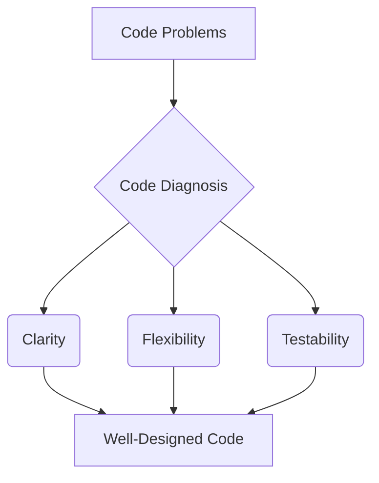

# Code Diagnosis: Improving Clarity, Flexibility, and Testability

_Overview Diagram_

## Introduction

Code diagnosis is the process of reviewing existing code to identify underlying design problems. The goal is not just to find bugs, but to improve the overall quality of the codebase across three key factors: **Clarity**, **Flexibility**, and **Testability**. It is crucial to diagnose problems _before_ starting to refactor, as this ensures that changes are targeted and effective.

## 1. Problems with Code Clarity

Clarity refers to how easily a developer can read and understand the code. Poor clarity slows down development and increases the risk of introducing new bugs.

- **Large Code Files & Classes:** Modules with hundreds or thousands of lines, and classes with dozens of instance variables, are difficult to navigate and comprehend. This often indicates that a class or module has too many responsibilities and should be split up.
- **Poor Naming:** Vague or abbreviated names for variables, methods, and classes force developers to guess their purpose. Good names, supplemented by type hints and documentation where necessary, are self-explanatory.
- **Complicated Logic:** Deeply nested `if/else` statements and complex conditional blocks within a single method make it hard to follow the code's execution path. This logic should be broken down into smaller, well-named functions or methods.
- **Overuse of "Python Magic":** While Python allows for powerful metaprogramming (e.g., custom decorators, dunder methods), overusing it can make the code's behavior non-obvious and difficult for new developers to understand. Magic should be used sparingly and only when it provides a significant, clear benefit.

## 2. Problems with Code Flexibility

Flexibility is the ability to change one part of the code without causing a cascade of required changes in other parts. Inflexible code is brittle and expensive to maintain.

- **Too Many Dependencies (Imports):** A long list of imports at the top of a file is a strong indicator of high coupling. The module depends on many other parts of the system, making it difficult to change or reuse in isolation.
- **Deep Inheritance & Mixins:** Inheritance is one of the strongest forms of coupling. A subclass is tightly bound to its superclass. Deep hierarchies or mixins (inheriting from multiple classes) multiply this problem, creating a tangled web of dependencies that is very hard to refactor.
- **Passing Too Much Data ("Inappropriate Intimacy"):** A function should only receive the data it absolutely needs. Passing a whole object when only one of its attributes is required is a violation of the Law of Demeter. This creates unnecessary coupling, as the function now needs to know about the internal structure of the object.
- **Repeated Code (Duplication):** Copy-pasted code segments are a major red flag. They point to a lack of abstraction and mean that any change or bug fix must be applied in multiple places, which is error-prone. This code should be generalized into a single, reusable function or class.

## 3. Problems with Code Testability

Testable code can be easily and reliably verified with automated tests. Code that is hard to test is often left untested, leading to a less robust system.

- **Creating Resources In-Place:** A function or class `__init__` method should not create its own dependencies, such as database connections, file handlers, or external API clients. This makes the code impossible to unit test without interacting with a live external system. **Dependency Injection** (passing dependencies in as arguments) solves this by allowing mock objects to be used during testing.
- **Lack of Abstractions:** Code that depends on concrete classes (e.g., `SMTP_Server`) instead of abstractions (e.g., an `EmailSender` protocol) is difficult to test. By depending on an abstract interface, you can easily substitute a mock implementation for testing purposes.
- **Tightly Coupled Code:** A function that reaches out to global state (like a configuration manager) or directly calls other parts of the system is hard to test in isolation. It has hidden dependencies that must be set up, making tests complex and brittle.

### Reference

Code diagnosis workshop by [ArjanCodes](https://www.youtube.com/@ArjanCodes)
