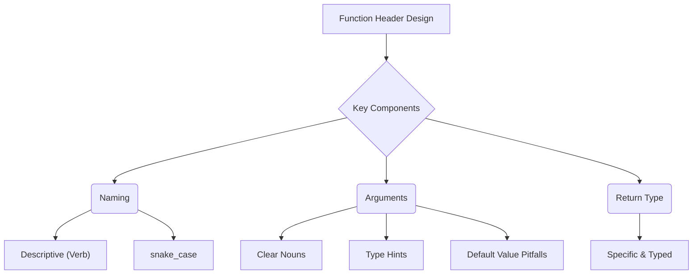

# How to Design the Perfect Python Function Header

_Overview Diagram_

### Introduction

A function's header (its first line) is its public interface. A well-designed header makes code readable, maintainable, and less prone to errors. The header consists of three crucial parts: the function name, its arguments, and its return type.

### 1. Function Naming

A function's name should clearly and concisely describe what it does.

- **Be Descriptive:** The name should be an action, typically starting with a verb (e.g., `calculate_total_price`, `log_message`). Avoid overly generic names like `total` that don't explain the function's behavior.
- **Follow Conventions:** In Python, the convention for function and variable names is `snake_case` (lowercase words separated by underscores).
- **Don't Include Types in the Name:** Avoid names like `calculate_integer_total_price`. The type information should be in the type hints, not the name itself.
- **Indicate Single Responsibility:** If a function name includes "and" (e.g., `collect_and_summarize_invoices`), it's a strong sign that the function is doing too much and should be split into smaller, more focused functions.
- **Use Consistent Vocabulary:** Use the same terms for the same concepts throughout your codebase. If you call something an `article`, don't refer to it as a `story` elsewhere.
- **Indicate Private Functions:** By convention, prefix a function name with a single underscore (e.g., `_private_function`) to signal that it is for internal use within the module and not part of the public API.

### 2. Function Arguments

Arguments define the data a function needs to operate.

- **Name Arguments Clearly:** Argument names should be descriptive nouns (e.g., `item_prices`, `discount`). This improves readability, especially when arguments are passed using keywords.
- **Use Type Hints:** Always add type annotations to arguments. This serves as documentation and allows static type checkers (like Mypy or those in your IDE) to catch errors before runtime.
- **Keep the Number of Arguments Low:** A function with more than 3 or 4 arguments can be difficult to use. If you need more, consider grouping related arguments into a dedicated object, such as a `TypedDict` or a `dataclass`.
  - **TypedDict:** Good for simple, optional option bags.
  - **Data Class:** Better when you need default values and more structure.
- **Handle Default Arguments Carefully:**
  - **Rule:** Non-default arguments must always come before default arguments.
  - **Pitfall 1: Mutable Default Arguments:** **Never** use mutable types like `list` or `dict` as default values (e.g., `to: list[int] = []`). The default object is created only _once_ when the module is loaded and is shared across all calls to the function, leading to unexpected side effects. The correct pattern is to default to `None` and create a new list inside the function if one isn't provided.
  - **Pitfall 2: Runtime-Calculated Defaults:** Do not use values that are calculated at runtime as defaults (e.g., `timestamp: float = time.time()`). This value is also calculated only once when the module loads, so every call will get the same timestamp. Again, the correct pattern is to default to `None` and calculate the value inside the function.
- **Using `*args` and `**kwargs`:\*\*
  - `*args` collects any number of positional arguments into a tuple.
  - `**kwargs` collects any number of keyword arguments into a dictionary.
  - These are useful for writing flexible wrappers or decorators, but should be avoided in regular functions as they hide the function's explicit interface. You can use more descriptive names (e.g., `*floats` or `**overrides`) to improve clarity.

### 3. Return Type

Be explicit about what your function returns.

- **Principle:** "Be generic in what you accept, but specific in what you return."
- **Be Specific:** If your function returns a `list`, type hint the return as `list[int]`, not the more generic `Iterable[int]`. This gives the user of your function more information and allows them to use list-specific methods (like indexing or `append`) without triggering type errors.
- **No Return Value:** If a function does not return anything, explicitly type it with `-> None`. This makes it clear that the function is intended to produce a side effect (e.g., printing to the console, saving to a file).
- **Use Generics for Flexibility:** For functions that operate on different types, use Python's generics (`TypeVar` or the newer `[T]` syntax) to create a flexible yet type-safe interface. This allows you to write one function that can work with `int`, `float`, and `Decimal` while ensuring the input and output types remain consistent.

### Reference

[Things (Almost) No One Thinks About When Designing Functions in Python](https://www.youtube.com/watch?v=WI6CqykFbDc&t) by [ArjanCodes](https://www.youtube.com/@ArjanCodes)
