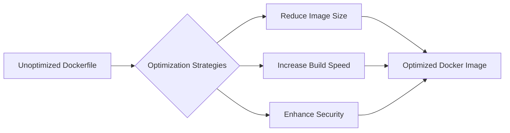

# How to Create the PERFECT Dockerfile

_Overview Diagram_



### Introduction

Poorly written Dockerfiles can lead to slow deployments, large image sizes, and security vulnerabilities. This guide walks through a step-by-step process of optimizing a basic Dockerfile for a Python application, making it smaller, faster, and more secure.

### The Starting Point: A Basic (but bad) Dockerfile

A common but inefficient approach is to start with a generic OS image, install dependencies, and copy all files.

- **Base Image:** `FROM ubuntu`
- **Problem:** This pulls in a full operating system with many unnecessary tools and libraries.
- **Result:** A very large image (~937 MB) and a slow build time (~36 seconds).

### Step 1: Pick a Better Base Image

Choosing a base image tailored to your application is the single biggest improvement you can make.

- **Change:** Use an official language-specific image, like `python`.
- **Better:** Use a `slim` variant, which is smaller because it omits common but often unnecessary packages.
- **Command:** `FROM python:slim-bookworm`
- **Result:** Image size drops significantly (e.g., to ~868 MB).

### Step 2: Use Explicit Tags

The `:latest` tag is a "rolling tag" that constantly changes. This can lead to unexpected build failures when a new version is released.

- **Change:** Pin your base image to a specific version. This ensures reproducible builds.
- **Command:** `FROM python:3.13-slim-bookworm`
- **Result:** Your builds are now stable and predictable.

### Step 3: Remove Unnecessary Installations & Clean Up

Package managers often install "recommended" packages that aren't strictly required. You should also clean up the package manager's cache after installation.

- **Change:**
  1.  Use the `--no-install-recommends` flag with `apt-get`.
  2.  In the _same_ `RUN` command, clean up the cache with `apt-get clean && rm -rf /var/lib/apt/lists/*`.
- **Why in the same command?** Each `RUN` command creates a new layer in the Docker image. If you clean up in a separate `RUN` command, the files from the previous layer are still there, and the image size won't decrease.
- **Result:** Image size is further reduced (e.g., to ~772 MB).

### Step 4: Use a Faster Dependency Manager (uv)

For Python, tools like `uv` are significantly faster at installing dependencies than traditional tools like `poetry` or `pip`.

- **Change:** Replace the `poetry install` command with `uv sync`. This requires installing `uv` first.
- **Result:** A dramatic reduction in build time (e.g., from ~30 seconds to ~8 seconds).

### Step 5: Use a Multi-Stage Build

A multi-stage build uses one stage to install build tools and compile your application (the "builder" stage), and a second, clean stage for the final production image. You then copy only the necessary artifacts from the builder to the production image.

- **Builder Stage:**
  - `FROM python:3.13-bookworm AS builder`
  - Install build tools (like `uv`), copy the `pyproject.toml`, and run `uv sync` to install dependencies into a virtual environment (`.venv`).
- **Production Stage:**
  - `FROM python:3.13-slim-bookworm AS production` (starts from a clean, small image)
  - `COPY --from=builder /app/.venv ./.venv` (copies _only_ the installed dependencies from the builder stage).
  - Copy the application source code.
- **Result:** A massive reduction in the final image size (e.g., from >700 MB to ~219 MB), as all the build-time tools and caches are left behind in the discarded builder stage.

### Step 6: Improve Security

1.  **Copy Only What You Need:**
    - **Problem:** `COPY . .` copies everything from your build context, including sensitive files like `.env`, `.git` folders, or IDE settings. This is a security risk and can unnecessarily break the build cache.
    - **Solution:** Be specific. Only copy the files and folders required for the application to run, like `COPY ./src ./src`.

2.  **Mount Secrets Securely:**
    - **Problem:** Using `ENV` or `--build-arg` for secrets bakes them into the image layers, where they can be inspected.
    - **Solution:** Use Docker's secret mounting feature. The secret is mounted as a temporary file that is only available during the `RUN` command and is not saved in the final image.
    - **Command:** `RUN --mount=type=secret,id=DB_PASSWORD ...`

3.  **Run as a Non-Root User:**
    - **Problem:** By default, containers run as the `root` user, which is a significant security risk. If an attacker exploits a vulnerability in your app, they gain root access to the container.
    - **Solution:** Create a non-privileged user and switch to it before running your application.
    - **Commands:**
      ```dockerfile
      RUN useradd --create-home appuser
      USER appuser
      ```

### Final Result

By applying these optimizations, you can transform a large, slow, and insecure Docker image into one that is:

- **Small:** Significantly reducing storage costs and deployment times.
- **Fast to Build:** Improving your development and CI/CD pipeline efficiency.
- **Secure:** Reducing the attack surface and protecting sensitive credentials.

### Reference

[This Is How You Write an Efficient Python Dockerfile](https://www.youtube.com/watch?v=tc713anE3UY&t) by [ArjanCodes](https://www.youtube.com/@ArjanCodes)
