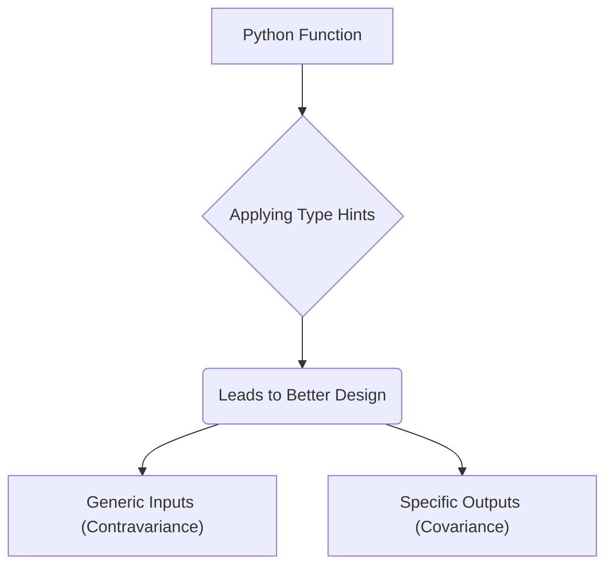

# The Real Power of Python's Type Hints

_Overview Diagram_



### Introduction to Type Hints

While Python is a dynamically typed language, type hints were introduced in Python 3.5 (via PEP 484) to allow for optional static type checking. They are ignored at runtime but can be analyzed by tools like `mypy` or integrated IDE checkers to catch type-related errors before the code is executed.

Since their introduction, type hints have evolved significantly:

- **Python 3.9 (PEP 585):** Introduced built-in generic types (e.g., `list[int]` instead of `List[int]` from the `typing` module).
- **Python 3.10 (PEP 613):** Added explicit type aliases.
- **Python 3.12 (PEP 695):** Introduced a new, cleaner syntax for generics.

### The True Benefit: Better Code Design

The most common benefit cited for type hints is catching type errors early. However, their real power lies in how they force developers to think more carefully about their data structures and function contracts. This thoughtful process naturally leads to better, more flexible, and more maintainable code design.

This is best understood through the principle: **Be generic in what you accept and specific in what you return.**

### 1. Generic Inputs (Contravariance)

When defining function parameters, you should use the most generic type possible that still allows the function to work. This makes your function more flexible and reusable.

**Problem: Overly Specific Input Type**
If a function only needs to iterate over a collection, specifying `list[float]` is too restrictive.

```python
# Too restrictive, won't accept a tuple or generator
def calculate_discount(items: list[float], discount: float) -> float:
    return sum(items) * (1 - discount)
```

**Solution: Use a Generic Iterable**
By using `Iterable`, the function now works with lists, tuples, sets, generators, and any other iterable type, significantly increasing its utility.

```python
from collections.abc import Iterable

# More flexible, accepts any iterable of floats
def calculate_discount(items: Iterable[float], discount: float) -> float:
    return sum(items) * (1 - discount)

# Now it works with lists, tuples, and generators
items_list = [100.0, 200.0, 300.0]
items_tuple = (100.0, 200.0, 300.0)
items_generator = (float(i) for i in range(100))

calculate_discount(items_list, 0.2)
calculate_discount(items_tuple, 0.2)
calculate_discount(items_generator, 0.2)
```

### 2. Specific Outputs (Covariance)

Conversely, when defining a function's return type, you should be as specific as possible. This provides the caller with the most information and prevents unexpected errors.

**Problem: Overly Generic Return Type**
If a function returns a `list`, but the type hint is `Iterable`, the caller's static type checker won't know that list-specific methods (like getting the `len()` or accessing by index) are available.

```python
from collections.abc import Iterable

# Return type is too generic
def calculate_discounts(items: Iterable[float], discount: float) -> Iterable[float]:
    return [item * (1 - discount) for item in items] # Actually returns a list

discounted_items = calculate_discounts([100.0], 0.2)
# print(len(discounted_items)) # This would cause a type error with a strict checker
```

**Solution: Be Specific About the Return Type**
Accurately typing the return value as `list` informs the caller of exactly what they are getting back, enabling them to use all its available methods without type errors.

```python
# Return type is now specific and accurate
def calculate_discounts(items: Iterable[float], discount: float) -> list[float]:
    return [item * (1 - discount) for item in items]

discounted_items = calculate_discounts([100.0], 0.2)
print(len(discounted_items)) # No type error
```

### 3. Using Abstractions with Protocols

Type hints also encourage the use of abstractions instead of concrete implementations, following the Dependency Inversion Principle. This is achieved in Python using `Protocol`.

**Problem: Depending on a Concrete Class**
A function that depends on a specific class like `JSONExporter` is tightly coupled and not easily extensible to other formats (e.g., `CSVExporter`).

```python
# Tightly coupled to JSONExporter
def generate_report(exporter: JSONExporter) -> str:
    # ...
```

**Solution: Depend on a Protocol (Interface)**
By defining a generic `Exporter` protocol and having the function depend on it, the code becomes highly flexible. Any class that implements the methods defined in the protocol can be used, without changing the `generate_report` function.

```python
from typing import Protocol, Any

class Exporter(Protocol):
    def export(self, data: dict[str, Any]) -> str:
        ...

class JSONExporter:
    def export(self, data: dict[str, Any]) -> str:
        # ... JSON export logic

class CSVExporter:
    def export(self, data: dict[str, Any]) -> str:
        # ... CSV export logic

# Now flexible, accepts any class that matches the Exporter protocol
def generate_report(exporter: Exporter) -> str:
    report_data = {"sales": 1000, "profit": 200}
    return exporter.export(report_data)

# Can easily switch between different exporters
generate_report(JSONExporter())
generate_report(CSVExporter())

```

### Reference

[The REAL Reason Python Type Hints Are Useful](https://www.youtube.com/watch?v=0oBLMwHdZ2Y) by [ArjanCodes](https://www.youtube.com/@ArjanCodes)
